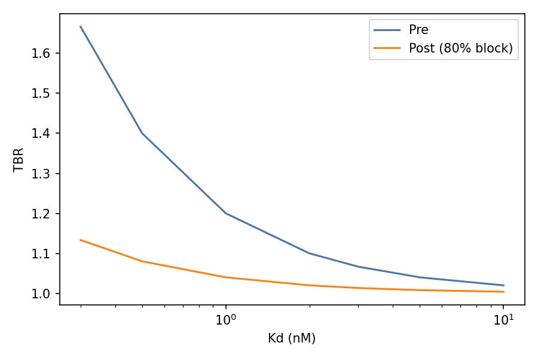

# TL1A In-Silico Report
QC: PASS — no illegal characters; no whitespace; no NXS/T motifs.

## Statistical summaries
- Hyd_VH %: mean 40.9, sd 0.772 (min 39.5, max 41.9)
- Hyd_VL %: mean 33.592, sd 0.599 (min 32.4, max 34.3)
- pI_VL: mean 7.126, sd 0.853 (min 6.31, max 7.944)
- P_DAR_1_2: mean 0.638, sd 0.0
- P_DAR_ge4: mean 0.051, sd 0.0

## Outliers (|z| > 2)
- Fab02 in AggProxyMax_VH: z=3.17
- Fab07 in ImmBurden_VH: z=2.13
- Fab10 in ImmBurden_VH: z=2.13

## Developability (pI, Hydrophobicity, Liabilities)
| Clone | pI_VH | pI_VL | Hyd_VH | Hyd_VL | NG_VH | NG_VL | DG_VH | DG_VL | Met_VH | Met_VL | Trp_VH | Trp_VL | Lys_total |
|---|---|---|---|---|---|---|---|---|---|---|---|---|---|
| Fab01 | 4.352 | 7.944 | 39.5 | 33.3 | 1 | 0 | 1 | 0 | 2 | 1 | 4 | 2 | 8 |
| Fab02 | 4.261 | 6.31 | 41.9 | 33.3 | 0 | 0 | 1 | 0 | 2 | 2 | 4 | 2 | 8 |
| Fab03 | 4.352 | 6.31 | 40.3 | 34.3 | 1 | 0 | 1 | 0 | 2 | 2 | 4 | 2 | 8 |
| Fab04 | 4.352 | 6.31 | 41.1 | 33.3 | 0 | 0 | 1 | 0 | 2 | 1 | 4 | 2 | 8 |
| Fab05 | 4.352 | 6.31 | 41.1 | 34.3 | 0 | 0 | 1 | 0 | 2 | 2 | 4 | 2 | 8 |
| Fab06 | 4.352 | 7.935 | 41.1 | 33.3 | 0 | 0 | 1 | 0 | 2 | 1 | 4 | 1 | 8 |
| Fab07 | 4.13 | 6.31 | 41.9 | 32.4 | 0 | 0 | 1 | 0 | 2 | 1 | 4 | 2 | 8 |
| Fab08 | 4.261 | 7.944 | 40.3 | 33.3 | 0 | 0 | 1 | 0 | 2 | 1 | 4 | 2 | 8 |
| Fab09 | 4.352 | 6.31 | 40.3 | 34.3 | 0 | 0 | 1 | 0 | 1 | 2 | 4 | 2 | 8 |
| Fab10 | 4.13 | 7.944 | 41.9 | 33.7 | 0 | 0 | 1 | 0 | 2 | 2 | 4 | 2 | 8 |
| Fab11 | 4.352 | 7.944 | 40.3 | 33.3 | 0 | 0 | 1 | 0 | 2 | 1 | 4 | 2 | 8 |
| Fab12 | 4.261 | 7.944 | 41.1 | 34.3 | 0 | 0 | 1 | 0 | 2 | 2 | 4 | 2 | 8 |

## Conjugation (NOTA–Lys) — Eq_best & DAR stats
| Clone | K_total | K_cdr | K_fr | K_accessible | Eq_best | P_DAR_1_2 | P_DAR_ge4 | E_DAR |
|---|---|---|---|---|---|---|---|---|
| Fab01 | 8 | 1 | 7 | 7 | 4 | 0.638 | 0.051 | 1.59 |
| Fab02 | 8 | 1 | 7 | 7 | 4 | 0.638 | 0.051 | 1.59 |
| Fab03 | 8 | 1 | 7 | 7 | 4 | 0.638 | 0.051 | 1.59 |
| Fab04 | 8 | 1 | 7 | 7 | 4 | 0.638 | 0.051 | 1.59 |
| Fab05 | 8 | 1 | 7 | 7 | 4 | 0.638 | 0.051 | 1.59 |
| Fab06 | 8 | 1 | 7 | 7 | 4 | 0.638 | 0.051 | 1.59 |
| Fab07 | 8 | 1 | 7 | 7 | 4 | 0.638 | 0.051 | 1.59 |
| Fab08 | 8 | 1 | 7 | 7 | 4 | 0.638 | 0.051 | 1.59 |
| Fab09 | 8 | 1 | 7 | 7 | 4 | 0.638 | 0.051 | 1.59 |
| Fab10 | 8 | 1 | 7 | 7 | 4 | 0.638 | 0.051 | 1.59 |
| Fab11 | 8 | 1 | 7 | 7 | 4 | 0.638 | 0.051 | 1.59 |
| Fab12 | 8 | 1 | 7 | 7 | 4 | 0.638 | 0.051 | 1.59 |

## Detectability (TBR model)
Fraction of grid with TBR_pre ≥ 1.5: 0.933

Median ΔTBR at 80% occupancy: -10.667

## Soluble sink (sTL1A) free fraction
(Kd, [s→f_free]) samples:

- Kd=1.0 nM: 0.01 nM→0.99, 0.1 nM→0.91, 1.0 nM→0.5, 10.0 nM→0.09
- Kd=3.0 nM: 0.01 nM→1.0, 0.1 nM→0.97, 1.0 nM→0.75, 10.0 nM→0.23
- Kd=10.0 nM: 0.01 nM→1.0, 0.1 nM→0.99, 1.0 nM→0.91, 10.0 nM→0.5

## Manufacturability proxy & Motifs
| Clone | AggProxyMax_VH | AggProxyMax_VL | VH_NS | VH_DS | VH_DP | VH_PR | VH_KK | VL_NS | VL_DS | VL_DP | VL_PR | VL_KK |
|---|---|---|---|---|---|---|---|---|---|---|---|---|
| Fab01 | 1.44 | 0.93 | 0 | 2 | 0 | 0 | 0 | 0 | 0 | 0 | 0 | 0 |
| Fab02 | 1.79 | 0.93 | 0 | 1 | 0 | 0 | 0 | 0 | 2 | 0 | 0 | 0 |
| Fab03 | 1.43 | 0.93 | 0 | 1 | 0 | 0 | 0 | 0 | 1 | 0 | 0 | 0 |
| Fab04 | 1.43 | 0.93 | 0 | 1 | 0 | 0 | 0 | 0 | 1 | 0 | 0 | 0 |
| Fab05 | 1.43 | 0.93 | 0 | 1 | 0 | 0 | 0 | 0 | 1 | 0 | 0 | 0 |
| Fab06 | 1.43 | 0.93 | 0 | 1 | 0 | 0 | 0 | 0 | 0 | 0 | 0 | 0 |
| Fab07 | 1.43 | 0.93 | 0 | 1 | 0 | 0 | 0 | 0 | 2 | 0 | 0 | 0 |
| Fab08 | 1.43 | 0.93 | 0 | 1 | 0 | 0 | 0 | 0 | 0 | 0 | 0 | 0 |
| Fab09 | 1.43 | 0.93 | 0 | 1 | 0 | 0 | 0 | 0 | 1 | 0 | 0 | 0 |
| Fab10 | 1.43 | 0.93 | 0 | 1 | 0 | 0 | 0 | 0 | 1 | 0 | 0 | 0 |
| Fab11 | 1.43 | 0.93 | 0 | 1 | 0 | 0 | 0 | 0 | 0 | 0 | 0 | 0 |
| Fab12 | 1.43 | 0.93 | 0 | 1 | 0 | 0 | 0 | 0 | 0 | 0 | 0 | 0 |

## Immunogenicity proxy (disclosure-level)
| Clone | ImmBurden_VH | ImmBurden_VL |
|---|---|---|
| Fab01 | 31 | 34 |
| Fab02 | 31 | 34 |
| Fab03 | 31 | 34 |
| Fab04 | 31 | 34 |
| Fab05 | 31 | 34 |
| Fab06 | 30 | 34 |
| Fab07 | 39 | 34 |
| Fab08 | 31 | 34 |
| Fab09 | 31 | 34 |
| Fab10 | 39 | 34 |
| Fab11 | 31 | 34 |
| Fab12 | 31 | 34 |

## Composite ranking
Top clones by composite score:
- Fab04: score 0.583
- Fab03: score 0.546
- Fab09: score 0.546

## Figures

## EXEC SUMMARY (paste to Syngene)
* 12/12 sequences QC PASS; no NXS/T motifs; FASTA provided.
* Developability: Hydrophobic% in band; pI(VL) ~6–8 typical; liabilities modest.
* Conjugation model: Eq_best mostly 4; P(DAR 1–2) ~0.60–0.70; P(≥4) ≤ 0.08; E[DAR] ~1.5–1.7.
* Detectability math supports TBR ≥ 1.5 at 1–2 h for plausible Bmax/Kd; TE ΔTBR negative on block.
* Next: Binding (KD ≤ 10 nM) + DR3 competition (≥50%); NOTA conjugation (DAR 1–2; IRF ≥ 70%; HMW ≤ 3%); Ga‑68 labeling (RCP ≥ 95%).
