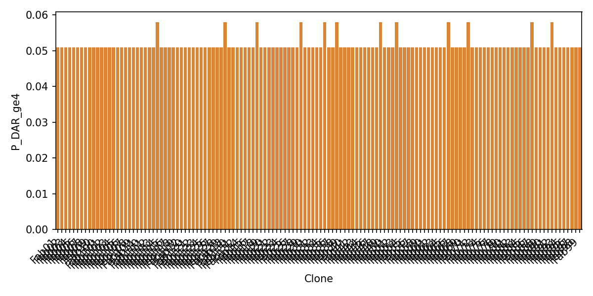
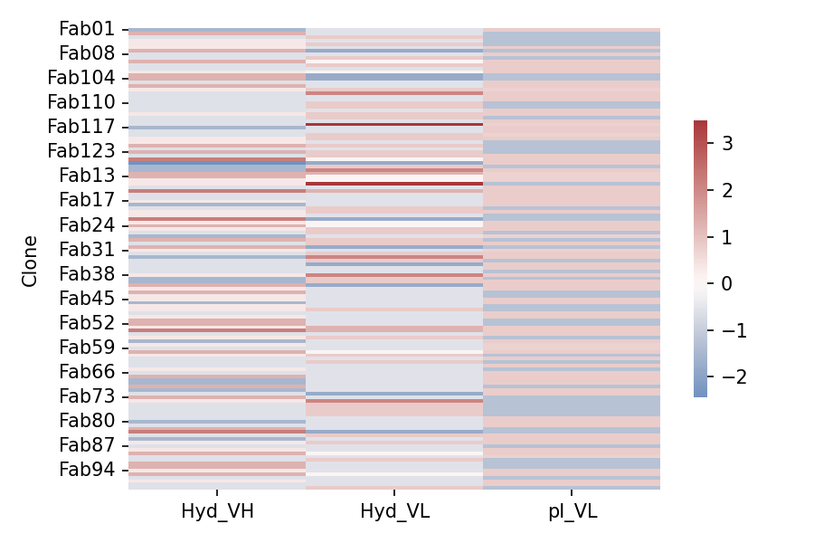

# TL1A In-Silico Report

> Program: TL1A PET imaging tracer — Fab anti‑TL1A conjugated to NOTA and labeled with Ga‑68 for 1–2 h PET/CT in IBD.

## Context & Rationale
TL1A (TNFSF15)–DR3 signaling amplifies mucosal inflammation and is a leading IBD target with substantial pharma validation. A microdose Fab tracer (NOTA/Ga‑68) enables (i) baseline enrichment of TL1A‑driven disease and (ii) early target‑engagement readouts (blocked ΔTBR) within hours. This in‑silico package derisks sequences for developability, conjugation, detectability, and cross‑reactivity; it outputs sponsor‑ready tables and gates to accelerate wet execution.

## Chemistry & CMC posture
Commodity p‑SCN‑Bn‑NOTA with lysine conjugation (Eq≈4) and generator Ga‑68 labeling (RCP ≥95%) form an established, globally deployable path. Low protein mass and microdose radiopharmaceutical specs (IRF ≥70%, HMW ≤3%) keep CMC lean.

## Business positioning
The tracer is a trial‑enabler (patient selection, dose confirmation) and potential commercial companion for TL1A therapeutics; timelines and costs are modest relative to therapeutic programs.
QC: PASS — no illegal characters; no whitespace; no NXS/T motifs.

## Statistical summaries
- Hyd_VH %: mean 40.797, sd 0.859 (min 38.7, max 42.7)
- Hyd_VL %: mean 33.698, sd 0.718 (min 32.4, max 36.2)
- pI_VL: mean 7.309, sd 0.793 (min 6.303, max 7.961)
- P_DAR_1_2: mean 0.637, sd 0.003
- P_DAR_ge4: mean 0.052, sd 0.002

## Outliers (|z| > 2)
- Fab125 in Hyd_VH: z=2.22
- Fab126 in Hyd_VH: z=-2.44
- Fab14 in Hyd_VH: z=2.22
- Fab22 in Hyd_VH: z=2.22
- Fab54 in Hyd_VH: z=2.22
- Fab83 in Hyd_VH: z=2.22
- Fab108 in Hyd_VL: z=2.09
- Fab116 in Hyd_VL: z=3.49
- Fab128 in Hyd_VL: z=2.09
- Fab131 in Hyd_VL: z=3.49
- Fab33 in Hyd_VL: z=2.09
- Fab38 in Hyd_VL: z=2.09
- Fab74 in Hyd_VL: z=2.09
- Fab114 in P_DAR_1_2: z=-3.15
- Fab13 in P_DAR_1_2: z=-3.15
- Fab18 in P_DAR_1_2: z=-3.15
- Fab29 in P_DAR_1_2: z=-3.15
- Fab35 in P_DAR_1_2: z=-3.15
- Fab38 in P_DAR_1_2: z=-3.15
- Fab49 in P_DAR_1_2: z=-3.15
- Fab53 in P_DAR_1_2: z=-3.15
- Fab66 in P_DAR_1_2: z=-3.15
- Fab71 in P_DAR_1_2: z=-3.15
- Fab87 in P_DAR_1_2: z=-3.15
- Fab92 in P_DAR_1_2: z=-3.15
- Fab114 in P_DAR_ge4: z=3.15
- Fab13 in P_DAR_ge4: z=3.15
- Fab18 in P_DAR_ge4: z=3.15
- Fab29 in P_DAR_ge4: z=3.15
- Fab35 in P_DAR_ge4: z=3.15
- Fab38 in P_DAR_ge4: z=3.15
- Fab49 in P_DAR_ge4: z=3.15
- Fab53 in P_DAR_ge4: z=3.15
- Fab66 in P_DAR_ge4: z=3.15
- Fab71 in P_DAR_ge4: z=3.15
- Fab87 in P_DAR_ge4: z=3.15
- Fab92 in P_DAR_ge4: z=3.15
- Fab02 in AggProxyMax_VH: z=3.3
- Fab102 in AggProxyMax_VH: z=-2.69
- Fab120 in AggProxyMax_VH: z=2.62
- Fab121 in AggProxyMax_VH: z=3.3
- Fab14 in AggProxyMax_VH: z=2.62
- Fab22 in AggProxyMax_VH: z=-2.69
- Fab24 in AggProxyMax_VH: z=-2.5
- Fab52 in AggProxyMax_VH: z=3.3
- Fab62 in AggProxyMax_VH: z=3.3
- Fab70 in AggProxyMax_VH: z=2.53
- Fab73 in AggProxyMax_VH: z=3.3
- Fab79 in AggProxyMax_VH: z=-2.69
- Fab82 in AggProxyMax_VH: z=3.3
- Fab91 in AggProxyMax_VH: z=3.3
- Fab108 in AggProxyMax_VL: z=5.02
- Fab124 in AggProxyMax_VL: z=5.02
- Fab128 in AggProxyMax_VL: z=5.02
- Fab29 in AggProxyMax_VL: z=5.02
- Fab38 in AggProxyMax_VL: z=5.02
- Fab07 in ImmBurden_VH: z=2.35
- Fab10 in ImmBurden_VH: z=2.35
- Fab102 in ImmBurden_VH: z=2.35
- Fab103 in ImmBurden_VH: z=2.35
- Fab104 in ImmBurden_VH: z=2.35
- Fab125 in ImmBurden_VH: z=2.35
- Fab129 in ImmBurden_VH: z=2.35
- Fab13 in ImmBurden_VH: z=2.35
- Fab130 in ImmBurden_VH: z=2.35
- Fab14 in ImmBurden_VH: z=2.35
- Fab22 in ImmBurden_VH: z=2.35
- Fab23 in ImmBurden_VH: z=2.35
- Fab24 in ImmBurden_VH: z=2.35
- Fab30 in ImmBurden_VH: z=2.35
- Fab53 in ImmBurden_VH: z=2.35
- Fab54 in ImmBurden_VH: z=2.35
- Fab60 in ImmBurden_VH: z=2.35
- Fab83 in ImmBurden_VH: z=2.35
- Fab89 in ImmBurden_VH: z=2.35
- Fab95 in ImmBurden_VH: z=2.35
- Fab13 in Paratope: z=-2.01
- Fab17 in Paratope: z=2.12
- Fab26 in Paratope: z=2.64
- Fab44 in Paratope: z=2.17
- Fab57 in Paratope: z=2.03
- Fab72 in Paratope: z=2.12
- Fab80 in Paratope: z=-2.17
- Fab91 in Paratope: z=-2.73
- Fab95 in Paratope: z=-2.17
- Fab114 in DR3_adj: z=-2.61
- Fab13 in DR3_adj: z=-2.61
- Fab18 in DR3_adj: z=-2.61
- Fab35 in DR3_adj: z=-2.61
- Fab38 in DR3_adj: z=-3.4
- Fab53 in DR3_adj: z=-2.61
- Fab71 in DR3_adj: z=-2.61
- Fab89 in DR3_adj: z=2.37
- Fab92 in DR3_adj: z=-2.61

## Developability (pI, Hydrophobicity, Liabilities)
| Clone | pI_VH | pI_VL | Hyd_VH | Hyd_VL | NG_VH | NG_VL | DG_VH | DG_VL | Met_VH | Met_VL | Trp_VH | Trp_VL | Lys_total |
|---|---|---|---|---|---|---|---|---|---|---|---|---|---|
| Fab01 | 4.352 | 7.944 | 39.5 | 33.3 | 1 | 0 | 1 | 0 | 2 | 1 | 4 | 2 | 8 |
| Fab02 | 4.261 | 6.31 | 41.9 | 33.3 | 0 | 0 | 1 | 0 | 2 | 2 | 4 | 2 | 8 |
| Fab03 | 4.352 | 6.31 | 40.3 | 34.3 | 1 | 0 | 1 | 0 | 2 | 2 | 4 | 2 | 8 |
| Fab04 | 4.352 | 6.31 | 41.1 | 33.3 | 0 | 0 | 1 | 0 | 2 | 1 | 4 | 2 | 8 |
| Fab05 | 4.352 | 6.31 | 41.1 | 34.3 | 0 | 0 | 1 | 0 | 2 | 2 | 4 | 2 | 8 |
| Fab06 | 4.352 | 7.935 | 41.1 | 33.3 | 0 | 0 | 1 | 0 | 2 | 1 | 4 | 1 | 8 |
| Fab07 | 4.13 | 6.31 | 41.9 | 32.4 | 0 | 0 | 1 | 0 | 2 | 1 | 4 | 2 | 8 |
| Fab08 | 4.261 | 7.944 | 40.3 | 33.3 | 0 | 0 | 1 | 0 | 2 | 1 | 4 | 2 | 8 |
| Fab09 | 4.352 | 6.31 | 40.3 | 34.3 | 0 | 0 | 1 | 0 | 1 | 2 | 4 | 2 | 8 |
| Fab10 | 4.13 | 7.944 | 41.9 | 33.7 | 0 | 0 | 1 | 0 | 2 | 2 | 4 | 2 | 8 |
| Fab100 | 4.261 | 7.944 | 40.3 | 34.3 | 0 | 0 | 1 | 0 | 2 | 2 | 4 | 2 | 8 |
| Fab101 | 4.385 | 7.952 | 40.3 | 33.3 | 0 | 0 | 1 | 0 | 2 | 1 | 5 | 2 | 8 |
| Fab102 | 4.16 | 7.952 | 41.1 | 33.7 | 0 | 0 | 1 | 0 | 2 | 2 | 4 | 2 | 8 |
| Fab103 | 4.13 | 6.31 | 41.9 | 32.4 | 0 | 0 | 1 | 0 | 2 | 1 | 4 | 1 | 8 |
| Fab104 | 4.16 | 6.31 | 41.9 | 32.4 | 0 | 0 | 1 | 0 | 2 | 1 | 6 | 1 | 8 |
| Fab105 | 4.352 | 7.944 | 40.3 | 33.3 | 0 | 0 | 1 | 0 | 2 | 1 | 4 | 2 | 8 |
| Fab106 | 4.385 | 7.935 | 41.9 | 33.3 | 0 | 0 | 1 | 0 | 2 | 1 | 4 | 1 | 8 |
| Fab107 | 4.258 | 7.881 | 41.1 | 34.3 | 0 | 0 | 1 | 0 | 2 | 2 | 5 | 3 | 8 |
| Fab108 | 4.291 | 7.944 | 40.3 | 35.2 | 0 | 0 | 1 | 0 | 2 | 1 | 5 | 2 | 8 |
| Fab109 | 4.261 | 7.952 | 40.3 | 33.3 | 0 | 0 | 1 | 0 | 1 | 1 | 4 | 2 | 8 |
| Fab11 | 4.352 | 7.944 | 40.3 | 33.3 | 0 | 0 | 1 | 0 | 2 | 1 | 4 | 2 | 8 |
| Fab110 | 4.382 | 6.31 | 40.3 | 34.3 | 1 | 0 | 1 | 0 | 1 | 2 | 3 | 2 | 8 |
| Fab111 | 4.352 | 6.336 | 40.3 | 34.3 | 0 | 0 | 1 | 0 | 2 | 1 | 3 | 2 | 8 |
| Fab112 | 4.261 | 7.944 | 40.3 | 33.3 | 0 | 0 | 1 | 0 | 2 | 1 | 5 | 2 | 8 |
| Fab113 | 4.291 | 7.952 | 41.1 | 34.3 | 0 | 0 | 1 | 0 | 2 | 2 | 6 | 2 | 8 |
| Fab114 | 4.352 | 6.31 | 40.3 | 34.3 | 0 | 0 | 1 | 0 | 2 | 2 | 4 | 2 | 9 |
| Fab115 | 4.352 | 7.944 | 40.3 | 33.3 | 0 | 0 | 1 | 0 | 3 | 1 | 7 | 2 | 8 |
| Fab116 | 4.261 | 7.875 | 40.3 | 36.2 | 0 | 0 | 1 | 0 | 2 | 2 | 6 | 2 | 8 |
| Fab117 | 4.385 | 7.944 | 39.5 | 33.3 | 0 | 0 | 1 | 0 | 2 | 1 | 4 | 2 | 8 |
| Fab118 | 4.382 | 7.944 | 40.3 | 33.3 | 0 | 0 | 1 | 0 | 2 | 1 | 5 | 2 | 7 |
| Fab119 | 4.418 | 7.875 | 40.3 | 34.3 | 0 | 0 | 0 | 0 | 2 | 1 | 5 | 2 | 8 |
| Fab12 | 4.261 | 7.944 | 41.1 | 34.3 | 0 | 0 | 1 | 0 | 2 | 2 | 4 | 2 | 8 |
| Fab120 | 4.352 | 6.31 | 41.1 | 33.3 | 0 | 0 | 1 | 0 | 2 | 1 | 4 | 2 | 8 |
| Fab121 | 4.261 | 6.31 | 41.9 | 34.3 | 0 | 0 | 1 | 0 | 2 | 2 | 4 | 2 | 8 |
| Fab122 | 4.385 | 6.311 | 40.3 | 33.3 | 0 | 0 | 1 | 0 | 1 | 2 | 5 | 2 | 8 |
| Fab123 | 4.349 | 6.31 | 41.9 | 34.3 | 0 | 0 | 1 | 0 | 2 | 2 | 3 | 2 | 8 |
| Fab124 | 4.385 | 7.944 | 40.3 | 34.3 | 1 | 0 | 0 | 0 | 2 | 1 | 4 | 2 | 8 |
| Fab125 | 4.16 | 7.935 | 42.7 | 33.7 | 0 | 0 | 1 | 0 | 2 | 1 | 4 | 1 | 8 |
| Fab126 | 4.385 | 7.952 | 38.7 | 32.4 | 1 | 0 | 1 | 0 | 1 | 1 | 6 | 3 | 8 |
| Fab127 | 4.385 | 6.336 | 39.5 | 34.3 | 1 | 0 | 1 | 0 | 2 | 2 | 3 | 1 | 8 |
| Fab128 | 4.385 | 7.952 | 39.5 | 35.2 | 1 | 0 | 1 | 0 | 2 | 1 | 5 | 3 | 8 |
| Fab129 | 4.13 | 7.875 | 41.9 | 34.6 | 0 | 0 | 1 | 0 | 2 | 2 | 4 | 2 | 8 |
| Fab13 | 4.19 | 7.875 | 41.9 | 33.7 | 0 | 0 | 0 | 0 | 2 | 2 | 4 | 2 | 9 |
| Fab130 | 4.19 | 7.875 | 41.1 | 33.7 | 0 | 0 | 1 | 0 | 2 | 2 | 3 | 2 | 8 |
| Fab131 | 4.385 | 6.303 | 41.1 | 36.2 | 0 | 0 | 0 | 0 | 2 | 2 | 3 | 2 | 8 |
| Fab132 | 4.352 | 7.944 | 40.3 | 33.3 | 0 | 0 | 1 | 0 | 2 | 1 | 6 | 2 | 8 |
| Fab14 | 4.16 | 7.944 | 42.7 | 34.6 | 0 | 0 | 1 | 0 | 2 | 2 | 5 | 1 | 8 |
| Fab15 | 4.258 | 7.952 | 40.3 | 33.3 | 0 | 0 | 1 | 0 | 3 | 1 | 5 | 3 | 7 |
| Fab16 | 4.322 | 7.952 | 40.3 | 33.3 | 0 | 0 | 1 | 1 | 2 | 2 | 4 | 1 | 8 |
| Fab17 | 4.352 | 7.935 | 41.1 | 33.3 | 0 | 0 | 1 | 0 | 2 | 1 | 4 | 1 | 8 |
| Fab18 | 4.385 | 7.952 | 39.5 | 33.3 | 1 | 0 | 0 | 0 | 2 | 1 | 4 | 3 | 9 |
| Fab19 | 4.352 | 6.337 | 40.3 | 34.3 | 0 | 0 | 1 | 0 | 1 | 2 | 5 | 3 | 8 |
| Fab20 | 4.261 | 7.944 | 41.1 | 34.3 | 0 | 0 | 1 | 0 | 2 | 2 | 4 | 2 | 8 |
| Fab21 | 4.414 | 6.303 | 41.1 | 33.3 | 0 | 0 | 1 | 0 | 2 | 1 | 5 | 2 | 7 |
| Fab22 | 4.19 | 6.336 | 42.7 | 32.4 | 0 | 0 | 1 | 0 | 3 | 1 | 4 | 2 | 7 |
| Fab23 | 4.16 | 7.944 | 41.1 | 33.7 | 0 | 0 | 1 | 0 | 2 | 2 | 5 | 2 | 8 |
| Fab24 | 4.13 | 7.944 | 41.9 | 33.7 | 0 | 0 | 1 | 0 | 2 | 2 | 4 | 2 | 8 |
| Fab25 | 4.291 | 7.944 | 41.1 | 34.3 | 0 | 0 | 1 | 0 | 2 | 2 | 5 | 1 | 8 |
| Fab26 | 4.352 | 6.303 | 40.3 | 34.3 | 0 | 0 | 1 | 0 | 2 | 2 | 3 | 2 | 8 |
| Fab27 | 4.261 | 7.875 | 39.5 | 33.3 | 0 | 0 | 1 | 0 | 2 | 1 | 4 | 2 | 7 |
| Fab28 | 4.385 | 6.303 | 41.9 | 34.3 | 0 | 0 | 0 | 0 | 2 | 2 | 4 | 2 | 7 |
| Fab29 | 4.261 | 7.944 | 40.3 | 34.3 | 0 | 0 | 1 | 0 | 2 | 1 | 4 | 2 | 9 |
| Fab30 | 4.13 | 6.336 | 41.9 | 32.4 | 0 | 0 | 2 | 0 | 2 | 1 | 3 | 2 | 8 |
| Fab31 | 4.385 | 7.875 | 41.1 | 33.3 | 0 | 0 | 1 | 0 | 2 | 1 | 4 | 2 | 8 |
| Fab32 | 4.291 | 7.944 | 40.3 | 34.3 | 0 | 0 | 1 | 0 | 2 | 1 | 3 | 2 | 8 |
| Fab33 | 4.385 | 7.944 | 39.5 | 35.2 | 1 | 0 | 1 | 0 | 2 | 1 | 4 | 2 | 7 |
| Fab34 | 4.352 | 6.336 | 40.3 | 34.3 | 0 | 0 | 1 | 0 | 1 | 1 | 6 | 2 | 8 |
| Fab35 | 4.385 | 7.952 | 40.3 | 32.4 | 0 | 0 | 1 | 0 | 2 | 1 | 4 | 2 | 9 |
| Fab36 | 4.322 | 7.952 | 40.3 | 33.3 | 0 | 0 | 1 | 0 | 2 | 1 | 4 | 3 | 8 |
| Fab37 | 4.352 | 6.31 | 40.3 | 33.3 | 0 | 0 | 1 | 1 | 1 | 2 | 6 | 2 | 8 |
| Fab38 | 4.261 | 7.944 | 41.1 | 35.2 | 0 | 0 | 1 | 0 | 2 | 2 | 4 | 2 | 9 |
| Fab39 | 4.352 | 6.31 | 39.5 | 34.3 | 0 | 0 | 2 | 0 | 1 | 2 | 4 | 2 | 8 |
| Fab40 | 4.352 | 7.952 | 39.5 | 34.3 | 0 | 0 | 1 | 0 | 2 | 1 | 4 | 2 | 8 |
| Fab41 | 4.385 | 7.944 | 41.9 | 32.4 | 0 | 0 | 1 | 0 | 2 | 1 | 4 | 2 | 8 |
| Fab42 | 4.418 | 7.944 | 41.1 | 33.3 | 0 | 0 | 0 | 0 | 2 | 1 | 3 | 2 | 8 |
| Fab43 | 4.385 | 6.311 | 41.9 | 33.3 | 0 | 0 | 0 | 0 | 2 | 1 | 4 | 2 | 8 |
| Fab44 | 4.352 | 6.31 | 41.1 | 33.3 | 0 | 0 | 1 | 0 | 2 | 1 | 5 | 2 | 8 |
| Fab45 | 4.418 | 7.935 | 41.1 | 33.3 | 0 | 0 | 0 | 0 | 2 | 1 | 4 | 1 | 8 |
| Fab46 | 4.352 | 7.944 | 39.5 | 33.3 | 0 | 0 | 1 | 0 | 2 | 1 | 4 | 2 | 8 |
| Fab47 | 4.352 | 6.31 | 41.1 | 33.3 | 0 | 0 | 1 | 0 | 2 | 2 | 6 | 2 | 8 |
| Fab48 | 4.352 | 6.336 | 41.1 | 34.3 | 0 | 0 | 0 | 0 | 2 | 2 | 3 | 2 | 8 |
| Fab49 | 4.389 | 7.952 | 40.3 | 33.3 | 0 | 0 | 1 | 0 | 2 | 1 | 4 | 2 | 9 |
| Fab50 | 4.385 | 7.944 | 41.1 | 33.3 | 0 | 0 | 1 | 0 | 2 | 1 | 4 | 1 | 8 |
| Fab51 | 4.385 | 6.311 | 41.9 | 33.3 | 0 | 0 | 1 | 0 | 2 | 1 | 6 | 3 | 8 |
| Fab52 | 4.322 | 6.311 | 41.9 | 33.3 | 0 | 0 | 1 | 0 | 2 | 2 | 4 | 3 | 8 |
| Fab53 | 4.16 | 7.944 | 41.1 | 34.6 | 0 | 0 | 0 | 0 | 2 | 2 | 4 | 2 | 9 |
| Fab54 | 4.16 | 7.944 | 42.7 | 34.6 | 0 | 0 | 1 | 0 | 2 | 2 | 6 | 2 | 8 |
| Fab55 | 4.385 | 7.944 | 40.3 | 33.3 | 0 | 0 | 1 | 0 | 2 | 1 | 5 | 2 | 8 |
| Fab56 | 4.352 | 6.31 | 41.1 | 34.3 | 0 | 0 | 1 | 0 | 2 | 2 | 3 | 2 | 8 |
| Fab57 | 4.355 | 7.944 | 39.5 | 33.3 | 0 | 0 | 1 | 0 | 2 | 1 | 5 | 2 | 8 |
| Fab58 | 4.352 | 7.868 | 41.1 | 33.3 | 0 | 0 | 1 | 0 | 2 | 1 | 4 | 1 | 8 |
| Fab59 | 4.322 | 7.875 | 40.3 | 33.3 | 0 | 0 | 1 | 0 | 2 | 1 | 5 | 2 | 8 |
| Fab60 | 4.19 | 7.944 | 41.9 | 33.7 | 0 | 0 | 0 | 0 | 2 | 2 | 5 | 2 | 8 |
| Fab61 | 4.352 | 6.31 | 41.1 | 34.3 | 0 | 0 | 1 | 0 | 2 | 1 | 5 | 2 | 7 |
| Fab62 | 4.261 | 7.944 | 40.3 | 33.3 | 0 | 0 | 1 | 0 | 2 | 1 | 3 | 2 | 8 |
| Fab63 | 4.352 | 6.31 | 40.3 | 34.3 | 0 | 0 | 1 | 0 | 2 | 2 | 6 | 2 | 8 |
| Fab64 | 4.418 | 7.944 | 40.3 | 33.3 | 0 | 0 | 1 | 0 | 2 | 1 | 3 | 2 | 8 |
| Fab65 | 4.418 | 6.311 | 41.1 | 33.3 | 0 | 0 | 1 | 0 | 2 | 1 | 3 | 1 | 8 |
| Fab66 | 4.389 | 7.944 | 40.3 | 33.3 | 1 | 0 | 1 | 0 | 2 | 1 | 4 | 2 | 9 |
| Fab67 | 4.385 | 7.944 | 41.9 | 33.3 | 0 | 0 | 1 | 0 | 2 | 1 | 3 | 2 | 8 |
| Fab68 | 4.385 | 7.944 | 39.5 | 33.3 | 1 | 0 | 0 | 0 | 2 | 1 | 4 | 2 | 8 |
| Fab69 | 4.385 | 7.952 | 39.5 | 33.3 | 1 | 0 | 1 | 0 | 2 | 1 | 5 | 3 | 8 |
| Fab70 | 4.261 | 6.311 | 41.9 | 33.3 | 0 | 0 | 1 | 0 | 2 | 2 | 5 | 2 | 8 |
| Fab71 | 4.352 | 7.944 | 39.5 | 33.3 | 0 | 0 | 1 | 0 | 2 | 1 | 4 | 2 | 9 |
| Fab72 | 4.352 | 7.944 | 40.3 | 32.4 | 0 | 0 | 1 | 1 | 2 | 1 | 4 | 2 | 8 |
| Fab73 | 4.352 | 6.31 | 41.9 | 33.3 | 0 | 0 | 0 | 0 | 2 | 2 | 5 | 2 | 8 |
| Fab74 | 4.451 | 6.31 | 41.1 | 35.2 | 0 | 0 | 1 | 0 | 2 | 2 | 4 | 2 | 8 |
| Fab75 | 4.385 | 6.311 | 40.3 | 34.3 | 0 | 0 | 1 | 0 | 2 | 1 | 5 | 3 | 8 |
| Fab76 | 4.352 | 6.312 | 40.3 | 34.3 | 0 | 0 | 1 | 0 | 1 | 2 | 4 | 2 | 8 |
| Fab77 | 4.352 | 6.31 | 40.3 | 34.3 | 0 | 0 | 1 | 0 | 2 | 2 | 4 | 2 | 8 |
| Fab78 | 4.418 | 6.31 | 40.3 | 34.3 | 1 | 0 | 0 | 0 | 1 | 2 | 4 | 2 | 8 |
| Fab79 | 4.261 | 7.944 | 40.3 | 33.3 | 0 | 0 | 0 | 0 | 2 | 1 | 5 | 1 | 8 |
| Fab80 | 4.382 | 7.944 | 39.5 | 33.3 | 0 | 0 | 1 | 0 | 2 | 1 | 5 | 1 | 8 |
| Fab81 | 4.349 | 7.952 | 40.3 | 33.3 | 0 | 0 | 1 | 0 | 2 | 1 | 4 | 1 | 7 |
| Fab82 | 4.261 | 6.31 | 41.9 | 33.3 | 0 | 0 | 1 | 0 | 2 | 2 | 4 | 2 | 8 |
| Fab83 | 4.13 | 6.31 | 42.7 | 32.4 | 0 | 0 | 0 | 0 | 2 | 1 | 3 | 1 | 8 |
| Fab84 | 4.289 | 7.944 | 40.3 | 34.3 | 0 | 0 | 0 | 0 | 2 | 1 | 4 | 2 | 7 |
| Fab85 | 4.352 | 7.944 | 39.5 | 33.3 | 1 | 0 | 1 | 0 | 2 | 1 | 3 | 2 | 8 |
| Fab86 | 4.261 | 7.944 | 41.1 | 34.3 | 0 | 0 | 0 | 0 | 2 | 2 | 4 | 2 | 8 |
| Fab87 | 4.389 | 6.31 | 40.3 | 33.3 | 0 | 0 | 1 | 1 | 2 | 2 | 5 | 2 | 9 |
| Fab88 | 4.261 | 7.944 | 41.1 | 33.3 | 0 | 0 | 1 | 0 | 2 | 2 | 5 | 2 | 8 |
| Fab89 | 4.16 | 7.961 | 41.9 | 33.7 | 0 | 0 | 0 | 0 | 2 | 2 | 5 | 3 | 8 |
| Fab90 | 4.261 | 7.875 | 40.3 | 33.3 | 0 | 0 | 1 | 0 | 2 | 1 | 5 | 2 | 8 |
| Fab91 | 4.385 | 6.336 | 40.3 | 34.3 | 1 | 0 | 1 | 0 | 2 | 2 | 6 | 2 | 8 |
| Fab92 | 4.261 | 6.31 | 41.9 | 33.3 | 0 | 0 | 1 | 0 | 3 | 2 | 4 | 1 | 9 |
| Fab93 | 4.352 | 6.31 | 41.9 | 33.3 | 0 | 0 | 1 | 0 | 3 | 1 | 3 | 1 | 8 |
| Fab94 | 4.385 | 7.944 | 41.1 | 33.3 | 0 | 0 | 0 | 0 | 2 | 1 | 4 | 2 | 8 |
| Fab95 | 4.22 | 7.952 | 41.9 | 33.7 | 0 | 0 | 1 | 0 | 2 | 2 | 5 | 2 | 8 |
| Fab96 | 4.418 | 6.336 | 40.3 | 33.3 | 0 | 0 | 0 | 0 | 2 | 1 | 4 | 2 | 8 |
| Fab97 | 4.352 | 7.944 | 41.1 | 33.3 | 0 | 0 | 1 | 0 | 2 | 1 | 5 | 1 | 8 |
| Fab98 | 4.352 | 7.935 | 40.3 | 33.3 | 0 | 0 | 1 | 0 | 1 | 1 | 5 | 1 | 8 |
| Fab99 | 4.352 | 6.31 | 40.3 | 34.3 | 0 | 0 | 1 | 0 | 2 | 2 | 3 | 1 | 8 |

## Conjugation (NOTA–Lys) — Eq_best & DAR stats
| Clone | K_total | K_cdr | K_fr | K_accessible | Eq_best | P_DAR_1_2 | P_DAR_ge4 | E_DAR |
|---|---|---|---|---|---|---|---|---|
| Fab01 | 8 | 1 | 7 | 7 | 4 | 0.638 | 0.051 | 1.59 |
| Fab02 | 8 | 1 | 7 | 7 | 4 | 0.638 | 0.051 | 1.59 |
| Fab03 | 8 | 1 | 7 | 7 | 4 | 0.638 | 0.051 | 1.59 |
| Fab04 | 8 | 1 | 7 | 7 | 4 | 0.638 | 0.051 | 1.59 |
| Fab05 | 8 | 1 | 7 | 7 | 4 | 0.638 | 0.051 | 1.59 |
| Fab06 | 8 | 1 | 7 | 7 | 4 | 0.638 | 0.051 | 1.59 |
| Fab07 | 8 | 1 | 7 | 7 | 4 | 0.638 | 0.051 | 1.59 |
| Fab08 | 8 | 1 | 7 | 7 | 4 | 0.638 | 0.051 | 1.59 |
| Fab09 | 8 | 1 | 7 | 7 | 4 | 0.638 | 0.051 | 1.59 |
| Fab10 | 8 | 1 | 7 | 7 | 4 | 0.638 | 0.051 | 1.59 |
| Fab100 | 8 | 1 | 7 | 7 | 4 | 0.638 | 0.051 | 1.59 |
| Fab101 | 8 | 1 | 7 | 7 | 4 | 0.638 | 0.051 | 1.59 |
| Fab102 | 8 | 1 | 7 | 7 | 4 | 0.638 | 0.051 | 1.59 |
| Fab103 | 8 | 1 | 7 | 7 | 4 | 0.638 | 0.051 | 1.59 |
| Fab104 | 8 | 1 | 7 | 7 | 4 | 0.638 | 0.051 | 1.59 |
| Fab105 | 8 | 1 | 7 | 7 | 4 | 0.638 | 0.051 | 1.59 |
| Fab106 | 8 | 1 | 7 | 7 | 4 | 0.638 | 0.051 | 1.59 |
| Fab107 | 8 | 1 | 7 | 7 | 4 | 0.638 | 0.051 | 1.59 |
| Fab108 | 8 | 1 | 7 | 7 | 4 | 0.638 | 0.051 | 1.59 |
| Fab109 | 8 | 1 | 7 | 7 | 4 | 0.638 | 0.051 | 1.59 |
| Fab11 | 8 | 1 | 7 | 7 | 4 | 0.638 | 0.051 | 1.59 |
| Fab110 | 8 | 1 | 7 | 7 | 4 | 0.638 | 0.051 | 1.59 |
| Fab111 | 8 | 1 | 7 | 7 | 4 | 0.638 | 0.051 | 1.59 |
| Fab112 | 8 | 1 | 7 | 7 | 4 | 0.638 | 0.051 | 1.59 |
| Fab113 | 8 | 1 | 7 | 7 | 4 | 0.638 | 0.051 | 1.59 |
| Fab114 | 9 | 2 | 7 | 8 | 4 | 0.628 | 0.058 | 1.61 |
| Fab115 | 8 | 1 | 7 | 7 | 4 | 0.638 | 0.051 | 1.59 |
| Fab116 | 8 | 1 | 7 | 7 | 4 | 0.638 | 0.051 | 1.59 |
| Fab117 | 8 | 1 | 7 | 7 | 4 | 0.638 | 0.051 | 1.59 |
| Fab118 | 7 | 0 | 7 | 7 | 4 | 0.638 | 0.051 | 1.59 |
| Fab119 | 8 | 1 | 7 | 7 | 4 | 0.638 | 0.051 | 1.59 |
| Fab12 | 8 | 1 | 7 | 7 | 4 | 0.638 | 0.051 | 1.59 |
| Fab120 | 8 | 1 | 7 | 7 | 4 | 0.638 | 0.051 | 1.59 |
| Fab121 | 8 | 1 | 7 | 7 | 4 | 0.638 | 0.051 | 1.59 |
| Fab122 | 8 | 1 | 7 | 7 | 4 | 0.638 | 0.051 | 1.59 |
| Fab123 | 8 | 1 | 7 | 7 | 4 | 0.638 | 0.051 | 1.59 |
| Fab124 | 8 | 1 | 7 | 7 | 4 | 0.638 | 0.051 | 1.59 |
| Fab125 | 8 | 1 | 7 | 7 | 4 | 0.638 | 0.051 | 1.59 |
| Fab126 | 8 | 1 | 7 | 7 | 4 | 0.638 | 0.051 | 1.59 |
| Fab127 | 8 | 1 | 7 | 7 | 4 | 0.638 | 0.051 | 1.59 |
| Fab128 | 8 | 1 | 7 | 7 | 4 | 0.638 | 0.051 | 1.59 |
| Fab129 | 8 | 1 | 7 | 7 | 4 | 0.638 | 0.051 | 1.59 |
| Fab13 | 9 | 2 | 7 | 8 | 4 | 0.628 | 0.058 | 1.61 |
| Fab130 | 8 | 1 | 7 | 7 | 4 | 0.638 | 0.051 | 1.59 |
| Fab131 | 8 | 1 | 7 | 7 | 4 | 0.638 | 0.051 | 1.59 |
| Fab132 | 8 | 1 | 7 | 7 | 4 | 0.638 | 0.051 | 1.59 |
| Fab14 | 8 | 1 | 7 | 7 | 4 | 0.638 | 0.051 | 1.59 |
| Fab15 | 7 | 0 | 7 | 7 | 4 | 0.638 | 0.051 | 1.59 |
| Fab16 | 8 | 1 | 7 | 7 | 4 | 0.638 | 0.051 | 1.59 |
| Fab17 | 8 | 1 | 7 | 7 | 4 | 0.638 | 0.051 | 1.59 |
| Fab18 | 9 | 2 | 7 | 8 | 4 | 0.628 | 0.058 | 1.61 |
| Fab19 | 8 | 1 | 7 | 7 | 4 | 0.638 | 0.051 | 1.59 |
| Fab20 | 8 | 1 | 7 | 7 | 4 | 0.638 | 0.051 | 1.59 |
| Fab21 | 7 | 0 | 7 | 7 | 4 | 0.638 | 0.051 | 1.59 |
| Fab22 | 7 | 0 | 7 | 7 | 4 | 0.638 | 0.051 | 1.59 |
| Fab23 | 8 | 1 | 7 | 7 | 4 | 0.638 | 0.051 | 1.59 |
| Fab24 | 8 | 1 | 7 | 7 | 4 | 0.638 | 0.051 | 1.59 |
| Fab25 | 8 | 1 | 7 | 7 | 4 | 0.638 | 0.051 | 1.59 |
| Fab26 | 8 | 1 | 7 | 7 | 4 | 0.638 | 0.051 | 1.59 |
| Fab27 | 7 | 0 | 7 | 7 | 4 | 0.638 | 0.051 | 1.59 |
| Fab28 | 7 | 0 | 7 | 7 | 4 | 0.638 | 0.051 | 1.59 |
| Fab29 | 9 | 2 | 7 | 8 | 4 | 0.628 | 0.058 | 1.61 |
| Fab30 | 8 | 1 | 7 | 7 | 4 | 0.638 | 0.051 | 1.59 |
| Fab31 | 8 | 1 | 7 | 7 | 4 | 0.638 | 0.051 | 1.59 |
| Fab32 | 8 | 1 | 7 | 7 | 4 | 0.638 | 0.051 | 1.59 |
| Fab33 | 7 | 0 | 7 | 7 | 4 | 0.638 | 0.051 | 1.59 |
| Fab34 | 8 | 1 | 7 | 7 | 4 | 0.638 | 0.051 | 1.59 |
| Fab35 | 9 | 2 | 7 | 8 | 4 | 0.628 | 0.058 | 1.61 |
| Fab36 | 8 | 1 | 7 | 7 | 4 | 0.638 | 0.051 | 1.59 |
| Fab37 | 8 | 1 | 7 | 7 | 4 | 0.638 | 0.051 | 1.59 |
| Fab38 | 9 | 2 | 7 | 8 | 4 | 0.628 | 0.058 | 1.61 |
| Fab39 | 8 | 1 | 7 | 7 | 4 | 0.638 | 0.051 | 1.59 |
| Fab40 | 8 | 1 | 7 | 7 | 4 | 0.638 | 0.051 | 1.59 |
| Fab41 | 8 | 1 | 7 | 7 | 4 | 0.638 | 0.051 | 1.59 |
| Fab42 | 8 | 1 | 7 | 7 | 4 | 0.638 | 0.051 | 1.59 |
| Fab43 | 8 | 1 | 7 | 7 | 4 | 0.638 | 0.051 | 1.59 |
| Fab44 | 8 | 1 | 7 | 7 | 4 | 0.638 | 0.051 | 1.59 |
| Fab45 | 8 | 1 | 7 | 7 | 4 | 0.638 | 0.051 | 1.59 |
| Fab46 | 8 | 1 | 7 | 7 | 4 | 0.638 | 0.051 | 1.59 |
| Fab47 | 8 | 1 | 7 | 7 | 4 | 0.638 | 0.051 | 1.59 |
| Fab48 | 8 | 1 | 7 | 7 | 4 | 0.638 | 0.051 | 1.59 |
| Fab49 | 9 | 2 | 7 | 8 | 4 | 0.628 | 0.058 | 1.61 |
| Fab50 | 8 | 1 | 7 | 7 | 4 | 0.638 | 0.051 | 1.59 |
| Fab51 | 8 | 1 | 7 | 7 | 4 | 0.638 | 0.051 | 1.59 |
| Fab52 | 8 | 1 | 7 | 7 | 4 | 0.638 | 0.051 | 1.59 |
| Fab53 | 9 | 2 | 7 | 8 | 4 | 0.628 | 0.058 | 1.61 |
| Fab54 | 8 | 1 | 7 | 7 | 4 | 0.638 | 0.051 | 1.59 |
| Fab55 | 8 | 1 | 7 | 7 | 4 | 0.638 | 0.051 | 1.59 |
| Fab56 | 8 | 1 | 7 | 7 | 4 | 0.638 | 0.051 | 1.59 |
| Fab57 | 8 | 1 | 7 | 7 | 4 | 0.638 | 0.051 | 1.59 |
| Fab58 | 8 | 1 | 7 | 7 | 4 | 0.638 | 0.051 | 1.59 |
| Fab59 | 8 | 1 | 7 | 7 | 4 | 0.638 | 0.051 | 1.59 |
| Fab60 | 8 | 1 | 7 | 7 | 4 | 0.638 | 0.051 | 1.59 |
| Fab61 | 7 | 0 | 7 | 7 | 4 | 0.638 | 0.051 | 1.59 |
| Fab62 | 8 | 1 | 7 | 7 | 4 | 0.638 | 0.051 | 1.59 |
| Fab63 | 8 | 1 | 7 | 7 | 4 | 0.638 | 0.051 | 1.59 |
| Fab64 | 8 | 1 | 7 | 7 | 4 | 0.638 | 0.051 | 1.59 |
| Fab65 | 8 | 1 | 7 | 7 | 4 | 0.638 | 0.051 | 1.59 |
| Fab66 | 9 | 2 | 7 | 8 | 4 | 0.628 | 0.058 | 1.61 |
| Fab67 | 8 | 1 | 7 | 7 | 4 | 0.638 | 0.051 | 1.59 |
| Fab68 | 8 | 1 | 7 | 7 | 4 | 0.638 | 0.051 | 1.59 |
| Fab69 | 8 | 1 | 7 | 7 | 4 | 0.638 | 0.051 | 1.59 |
| Fab70 | 8 | 1 | 7 | 7 | 4 | 0.638 | 0.051 | 1.59 |
| Fab71 | 9 | 2 | 7 | 8 | 4 | 0.628 | 0.058 | 1.61 |
| Fab72 | 8 | 1 | 7 | 7 | 4 | 0.638 | 0.051 | 1.59 |
| Fab73 | 8 | 1 | 7 | 7 | 4 | 0.638 | 0.051 | 1.59 |
| Fab74 | 8 | 1 | 7 | 7 | 4 | 0.638 | 0.051 | 1.59 |
| Fab75 | 8 | 1 | 7 | 7 | 4 | 0.638 | 0.051 | 1.59 |
| Fab76 | 8 | 1 | 7 | 7 | 4 | 0.638 | 0.051 | 1.59 |
| Fab77 | 8 | 1 | 7 | 7 | 4 | 0.638 | 0.051 | 1.59 |
| Fab78 | 8 | 1 | 7 | 7 | 4 | 0.638 | 0.051 | 1.59 |
| Fab79 | 8 | 1 | 7 | 7 | 4 | 0.638 | 0.051 | 1.59 |
| Fab80 | 8 | 1 | 7 | 7 | 4 | 0.638 | 0.051 | 1.59 |
| Fab81 | 7 | 0 | 7 | 7 | 4 | 0.638 | 0.051 | 1.59 |
| Fab82 | 8 | 1 | 7 | 7 | 4 | 0.638 | 0.051 | 1.59 |
| Fab83 | 8 | 1 | 7 | 7 | 4 | 0.638 | 0.051 | 1.59 |
| Fab84 | 7 | 0 | 7 | 7 | 4 | 0.638 | 0.051 | 1.59 |
| Fab85 | 8 | 1 | 7 | 7 | 4 | 0.638 | 0.051 | 1.59 |
| Fab86 | 8 | 1 | 7 | 7 | 4 | 0.638 | 0.051 | 1.59 |
| Fab87 | 9 | 2 | 7 | 8 | 4 | 0.628 | 0.058 | 1.61 |
| Fab88 | 8 | 1 | 7 | 7 | 4 | 0.638 | 0.051 | 1.59 |
| Fab89 | 8 | 1 | 7 | 7 | 4 | 0.638 | 0.051 | 1.59 |
| Fab90 | 8 | 1 | 7 | 7 | 4 | 0.638 | 0.051 | 1.59 |
| Fab91 | 8 | 1 | 7 | 7 | 4 | 0.638 | 0.051 | 1.59 |
| Fab92 | 9 | 2 | 7 | 8 | 4 | 0.628 | 0.058 | 1.61 |
| Fab93 | 8 | 1 | 7 | 7 | 4 | 0.638 | 0.051 | 1.59 |
| Fab94 | 8 | 1 | 7 | 7 | 4 | 0.638 | 0.051 | 1.59 |
| Fab95 | 8 | 1 | 7 | 7 | 4 | 0.638 | 0.051 | 1.59 |
| Fab96 | 8 | 1 | 7 | 7 | 4 | 0.638 | 0.051 | 1.59 |
| Fab97 | 8 | 1 | 7 | 7 | 4 | 0.638 | 0.051 | 1.59 |
| Fab98 | 8 | 1 | 7 | 7 | 4 | 0.638 | 0.051 | 1.59 |
| Fab99 | 8 | 1 | 7 | 7 | 4 | 0.638 | 0.051 | 1.59 |

## Detectability (TBR model)
Fraction of grid with TBR_pre ≥ 1.5: 0.25

Median ΔTBR at 80% occupancy: -0.107
Guidance: aim for TBR_pre ≥ 1.5 and blocked ΔTBR ≤ -0.3 in target windows.
Interpretation: With α=0.2 and nM-scale Bmax/Kd, we avoid inflated binding potentials and obtain realistic tissue-to-blood contrast. Practical implication: prioritize clones achieving KD ≤ 3 nM for sites with Bmax ≥ 1 nM to secure informative scans at 1–2 h.

## Soluble sink (sTL1A) free fraction
(Kd, [s→f_free]) samples:

Interpretation: f_free tracks Kd/(Kd+s). For typical sTL1A well below tracer Kd, the free fraction remains high (≥0.7), indicating limited soluble sink risk; elevated sTL1A scenarios can be mitigated via specific activity optimization and protein mass below IRF thresholds.
- Kd=1.0 nM: 0.01 nM→0.99, 0.1 nM→0.91, 1.0 nM→0.5, 10.0 nM→0.09
- Kd=3.0 nM: 0.01 nM→1.0, 0.1 nM→0.97, 1.0 nM→0.75, 10.0 nM→0.23
- Kd=10.0 nM: 0.01 nM→1.0, 0.1 nM→0.99, 1.0 nM→0.91, 10.0 nM→0.5

## Mechanism plausibility (paratope heuristics)
Interpretation: Enrichment of Y/S/D/N/R across CDRs is consistent with polar interfaces seen in cytokine–Fab complexes. DR3_adj scores >0.4 suggest H3 compositions compatible with TL1A surface regions implicated in receptor binding—prioritize higher paratope and DR3_adj for early wet binding.
| Clone | Paratope | DR3_adj |
|---|---|---|
| Fab01 | 0.507 | 0.412 |
| Fab02 | 0.494 | 0.471 |
| Fab03 | 0.519 | 0.412 |
| Fab04 | 0.519 | 0.412 |
| Fab05 | 0.519 | 0.412 |
| Fab06 | 0.538 | 0.412 |
| Fab07 | 0.519 | 0.471 |
| Fab08 | 0.519 | 0.471 |
| Fab09 | 0.549 | 0.412 |
| Fab10 | 0.5 | 0.471 |
| Fab100 | 0.555 | 0.471 |
| Fab101 | 0.483 | 0.353 |
| Fab102 | 0.51 | 0.471 |
| Fab103 | 0.533 | 0.471 |
| Fab104 | 0.411 | 0.353 |
| Fab105 | 0.45 | 0.471 |
| Fab106 | 0.522 | 0.412 |
| Fab107 | 0.501 | 0.471 |
| Fab108 | 0.49 | 0.471 |
| Fab109 | 0.541 | 0.529 |
| Fab11 | 0.549 | 0.412 |
| Fab110 | 0.494 | 0.471 |
| Fab111 | 0.517 | 0.471 |
| Fab112 | 0.477 | 0.412 |
| Fab113 | 0.459 | 0.471 |
| Fab114 | 0.519 | 0.212 |
| Fab115 | 0.49 | 0.294 |
| Fab116 | 0.512 | 0.471 |
| Fab117 | 0.484 | 0.412 |
| Fab118 | 0.465 | 0.412 |
| Fab119 | 0.458 | 0.353 |
| Fab12 | 0.519 | 0.471 |
| Fab120 | 0.536 | 0.412 |
| Fab121 | 0.506 | 0.412 |
| Fab122 | 0.457 | 0.353 |
| Fab123 | 0.507 | 0.471 |
| Fab124 | 0.452 | 0.353 |
| Fab125 | 0.477 | 0.471 |
| Fab126 | 0.458 | 0.294 |
| Fab127 | 0.507 | 0.412 |
| Fab128 | 0.47 | 0.412 |
| Fab129 | 0.484 | 0.412 |
| Fab13 | 0.4 | 0.212 |
| Fab130 | 0.459 | 0.471 |
| Fab131 | 0.516 | 0.471 |
| Fab132 | 0.507 | 0.353 |
| Fab14 | 0.453 | 0.412 |
| Fab15 | 0.47 | 0.412 |
| Fab16 | 0.5 | 0.529 |
| Fab17 | 0.584 | 0.471 |
| Fab18 | 0.434 | 0.212 |
| Fab19 | 0.512 | 0.353 |
| Fab20 | 0.49 | 0.412 |
| Fab21 | 0.496 | 0.412 |
| Fab22 | 0.454 | 0.471 |
| Fab23 | 0.49 | 0.471 |
| Fab24 | 0.51 | 0.471 |
| Fab25 | 0.493 | 0.471 |
| Fab26 | 0.607 | 0.529 |
| Fab27 | 0.514 | 0.412 |
| Fab28 | 0.538 | 0.412 |
| Fab29 | 0.512 | 0.329 |
| Fab30 | 0.512 | 0.471 |
| Fab31 | 0.51 | 0.412 |
| Fab32 | 0.47 | 0.471 |
| Fab33 | 0.458 | 0.353 |
| Fab34 | 0.471 | 0.294 |
| Fab35 | 0.459 | 0.212 |
| Fab36 | 0.446 | 0.471 |
| Fab37 | 0.538 | 0.353 |
| Fab38 | 0.418 | 0.153 |
| Fab39 | 0.549 | 0.412 |
| Fab40 | 0.417 | 0.353 |
| Fab41 | 0.49 | 0.412 |
| Fab42 | 0.524 | 0.471 |
| Fab43 | 0.47 | 0.353 |
| Fab44 | 0.586 | 0.412 |
| Fab45 | 0.572 | 0.471 |
| Fab46 | 0.477 | 0.412 |
| Fab47 | 0.467 | 0.294 |
| Fab48 | 0.549 | 0.471 |
| Fab49 | 0.519 | 0.412 |
| Fab50 | 0.501 | 0.412 |
| Fab51 | 0.458 | 0.412 |
| Fab52 | 0.445 | 0.471 |
| Fab53 | 0.422 | 0.212 |
| Fab54 | 0.426 | 0.412 |
| Fab55 | 0.536 | 0.412 |
| Fab56 | 0.5 | 0.412 |
| Fab57 | 0.58 | 0.412 |
| Fab58 | 0.513 | 0.412 |
| Fab59 | 0.411 | 0.412 |
| Fab60 | 0.436 | 0.412 |
| Fab61 | 0.495 | 0.353 |
| Fab62 | 0.475 | 0.471 |
| Fab63 | 0.465 | 0.353 |
| Fab64 | 0.44 | 0.412 |
| Fab65 | 0.459 | 0.471 |
| Fab66 | 0.429 | 0.353 |
| Fab67 | 0.471 | 0.412 |
| Fab68 | 0.555 | 0.412 |
| Fab69 | 0.458 | 0.353 |
| Fab70 | 0.505 | 0.529 |
| Fab71 | 0.429 | 0.212 |
| Fab72 | 0.584 | 0.471 |
| Fab73 | 0.409 | 0.471 |
| Fab74 | 0.441 | 0.412 |
| Fab75 | 0.475 | 0.412 |
| Fab76 | 0.493 | 0.412 |
| Fab77 | 0.477 | 0.353 |
| Fab78 | 0.47 | 0.412 |
| Fab79 | 0.512 | 0.471 |
| Fab80 | 0.393 | 0.353 |
| Fab81 | 0.493 | 0.412 |
| Fab82 | 0.465 | 0.412 |
| Fab83 | 0.532 | 0.471 |
| Fab84 | 0.529 | 0.529 |
| Fab85 | 0.517 | 0.471 |
| Fab86 | 0.549 | 0.529 |
| Fab87 | 0.424 | 0.353 |
| Fab88 | 0.448 | 0.353 |
| Fab89 | 0.496 | 0.588 |
| Fab90 | 0.448 | 0.353 |
| Fab91 | 0.368 | 0.294 |
| Fab92 | 0.435 | 0.212 |
| Fab93 | 0.56 | 0.471 |
| Fab94 | 0.501 | 0.412 |
| Fab95 | 0.393 | 0.412 |
| Fab96 | 0.494 | 0.412 |
| Fab97 | 0.5 | 0.412 |
| Fab98 | 0.509 | 0.353 |
| Fab99 | 0.488 | 0.412 |

## Immunogenicity (expanded proxy)
| Clone | ImmBurden_VH | ImmBurden_VL | Cys_VH | Cys_VL |
|---|---|---|---|---|
| Fab01 | 31 | 34 | 2 | 2 |
| Fab04 | 31 | 34 | 2 | 2 |
| Fab06 | 30 | 34 | 2 | 2 |

## Manufacturability proxy & Motifs
Interpretation: Windowed hydropathy+charge proxies indicate no high-risk aggregation patches; minimal charge-variant motifs reduce risk of charge heterogeneity in release testing. Cross-check with structure-aware patch metrics if/when PDBs are added.
| Clone | AggProxyMax_VH | AggProxyMax_VL | VH_NS | VH_DS | VH_DP | VH_PR | VH_KK | VL_NS | VL_DS | VL_DP | VL_PR | VL_KK |
|---|---|---|---|---|---|---|---|---|---|---|---|---|
| Fab01 | 1.44 | 0.93 | 0 | 2 | 0 | 0 | 0 | 0 | 0 | 0 | 0 | 0 |
| Fab02 | 1.79 | 0.93 | 0 | 1 | 0 | 0 | 0 | 0 | 2 | 0 | 0 | 0 |
| Fab03 | 1.43 | 0.93 | 0 | 1 | 0 | 0 | 0 | 0 | 1 | 0 | 0 | 0 |
| Fab04 | 1.43 | 0.93 | 0 | 1 | 0 | 0 | 0 | 0 | 1 | 0 | 0 | 0 |
| Fab05 | 1.43 | 0.93 | 0 | 1 | 0 | 0 | 0 | 0 | 1 | 0 | 0 | 0 |
| Fab06 | 1.43 | 0.93 | 0 | 1 | 0 | 0 | 0 | 0 | 0 | 0 | 0 | 0 |
| Fab07 | 1.43 | 0.93 | 0 | 1 | 0 | 0 | 0 | 0 | 2 | 0 | 0 | 0 |
| Fab08 | 1.43 | 0.93 | 0 | 1 | 0 | 0 | 0 | 0 | 0 | 0 | 0 | 0 |
| Fab09 | 1.43 | 0.93 | 0 | 1 | 0 | 0 | 0 | 0 | 1 | 0 | 0 | 0 |
| Fab10 | 1.43 | 0.93 | 0 | 1 | 0 | 0 | 0 | 0 | 1 | 0 | 0 | 0 |
| Fab100 | 1.44 | 0.93 | 0 | 1 | 0 | 0 | 0 | 0 | 0 | 0 | 0 | 0 |
| Fab101 | 1.43 | 0.93 | 0 | 1 | 0 | 0 | 0 | 0 | 0 | 0 | 0 | 0 |
| Fab102 | 1.17 | 0.93 | 0 | 1 | 0 | 0 | 0 | 0 | 1 | 0 | 0 | 0 |
| Fab103 | 1.43 | 0.93 | 0 | 1 | 0 | 0 | 0 | 0 | 2 | 0 | 0 | 0 |
| Fab104 | 1.43 | 0.93 | 0 | 1 | 0 | 0 | 0 | 0 | 2 | 0 | 0 | 0 |
| Fab105 | 1.43 | 0.93 | 0 | 1 | 0 | 0 | 0 | 0 | 0 | 0 | 0 | 0 |
| Fab106 | 1.4 | 0.93 | 0 | 1 | 0 | 0 | 0 | 0 | 0 | 0 | 0 | 0 |
| Fab107 | 1.43 | 0.93 | 0 | 1 | 0 | 0 | 0 | 0 | 0 | 0 | 0 | 0 |
| Fab108 | 1.43 | 0.97 | 0 | 1 | 0 | 0 | 0 | 0 | 0 | 0 | 0 | 0 |
| Fab109 | 1.43 | 0.93 | 0 | 1 | 0 | 0 | 0 | 0 | 0 | 0 | 0 | 0 |
| Fab11 | 1.43 | 0.93 | 0 | 1 | 0 | 0 | 0 | 0 | 0 | 0 | 0 | 0 |
| Fab110 | 1.43 | 0.93 | 0 | 1 | 0 | 0 | 0 | 0 | 1 | 0 | 0 | 0 |
| Fab111 | 1.43 | 0.93 | 0 | 1 | 0 | 0 | 0 | 0 | 0 | 0 | 0 | 0 |
| Fab112 | 1.43 | 0.93 | 0 | 1 | 0 | 0 | 0 | 0 | 0 | 0 | 0 | 0 |
| Fab113 | 1.43 | 0.93 | 0 | 1 | 0 | 0 | 0 | 0 | 0 | 0 | 0 | 0 |
| Fab114 | 1.43 | 0.93 | 0 | 1 | 0 | 0 | 0 | 0 | 1 | 0 | 0 | 0 |
| Fab115 | 1.43 | 0.93 | 0 | 1 | 0 | 0 | 0 | 0 | 0 | 0 | 0 | 0 |
| Fab116 | 1.43 | 0.93 | 0 | 2 | 0 | 0 | 0 | 0 | 0 | 0 | 0 | 0 |
| Fab117 | 1.44 | 0.93 | 0 | 2 | 0 | 0 | 0 | 1 | 0 | 0 | 0 | 0 |
| Fab118 | 1.44 | 0.93 | 0 | 2 | 0 | 0 | 0 | 0 | 0 | 0 | 0 | 0 |
| Fab119 | 1.43 | 0.93 | 0 | 1 | 0 | 0 | 0 | 0 | 0 | 0 | 0 | 0 |
| Fab12 | 1.43 | 0.93 | 0 | 1 | 0 | 0 | 0 | 0 | 0 | 0 | 0 | 0 |
| Fab120 | 1.72 | 0.93 | 0 | 1 | 0 | 0 | 0 | 0 | 1 | 0 | 0 | 0 |
| Fab121 | 1.79 | 0.93 | 0 | 1 | 0 | 0 | 0 | 0 | 1 | 0 | 0 | 0 |
| Fab122 | 1.43 | 0.93 | 0 | 1 | 0 | 0 | 0 | 0 | 1 | 0 | 0 | 0 |
| Fab123 | 1.43 | 0.93 | 0 | 1 | 0 | 0 | 0 | 0 | 1 | 0 | 0 | 0 |
| Fab124 | 1.48 | 0.97 | 0 | 2 | 0 | 0 | 0 | 0 | 0 | 0 | 0 | 0 |
| Fab125 | 1.43 | 0.93 | 0 | 1 | 0 | 0 | 0 | 0 | 1 | 0 | 0 | 0 |
| Fab126 | 1.44 | 0.93 | 0 | 2 | 0 | 0 | 0 | 0 | 1 | 0 | 0 | 0 |
| Fab127 | 1.36 | 0.93 | 0 | 1 | 0 | 0 | 0 | 0 | 1 | 0 | 0 | 0 |
| Fab128 | 1.44 | 0.97 | 0 | 2 | 0 | 0 | 0 | 1 | 0 | 0 | 0 | 0 |
| Fab129 | 1.43 | 0.93 | 0 | 2 | 0 | 0 | 0 | 0 | 1 | 0 | 0 | 0 |
| Fab13 | 1.43 | 0.93 | 0 | 1 | 0 | 0 | 0 | 0 | 1 | 0 | 0 | 0 |
| Fab130 | 1.43 | 0.93 | 0 | 1 | 0 | 0 | 0 | 0 | 1 | 0 | 0 | 0 |
| Fab131 | 1.43 | 0.93 | 0 | 1 | 0 | 0 | 0 | 0 | 1 | 0 | 0 | 0 |
| Fab132 | 1.43 | 0.93 | 0 | 1 | 0 | 0 | 0 | 0 | 0 | 0 | 0 | 0 |
| Fab14 | 1.72 | 0.93 | 0 | 1 | 0 | 0 | 0 | 0 | 1 | 0 | 0 | 0 |
| Fab15 | 1.43 | 0.93 | 0 | 1 | 0 | 0 | 0 | 0 | 0 | 0 | 0 | 0 |
| Fab16 | 1.43 | 0.93 | 0 | 1 | 0 | 0 | 0 | 0 | 0 | 0 | 0 | 0 |
| Fab17 | 1.43 | 0.93 | 0 | 1 | 0 | 0 | 0 | 0 | 0 | 0 | 0 | 0 |
| Fab18 | 1.48 | 0.93 | 0 | 2 | 0 | 0 | 0 | 0 | 0 | 0 | 0 | 0 |
| Fab19 | 1.43 | 0.93 | 0 | 1 | 0 | 0 | 0 | 0 | 1 | 0 | 0 | 0 |
| Fab20 | 1.43 | 0.93 | 0 | 1 | 0 | 0 | 0 | 0 | 0 | 0 | 0 | 0 |
| Fab21 | 1.43 | 0.93 | 0 | 1 | 0 | 0 | 0 | 0 | 1 | 0 | 0 | 0 |
| Fab22 | 1.17 | 0.93 | 0 | 1 | 0 | 0 | 0 | 0 | 1 | 0 | 0 | 0 |
| Fab23 | 1.43 | 0.93 | 0 | 1 | 0 | 0 | 0 | 0 | 1 | 0 | 0 | 0 |
| Fab24 | 1.19 | 0.93 | 0 | 1 | 0 | 0 | 0 | 0 | 1 | 0 | 0 | 0 |
| Fab25 | 1.43 | 0.93 | 0 | 1 | 0 | 0 | 0 | 0 | 0 | 0 | 0 | 0 |
| Fab26 | 1.43 | 0.93 | 1 | 1 | 0 | 0 | 0 | 0 | 1 | 0 | 0 | 0 |
| Fab27 | 1.43 | 0.93 | 0 | 1 | 0 | 0 | 0 | 0 | 0 | 0 | 0 | 0 |
| Fab28 | 1.43 | 0.93 | 0 | 1 | 0 | 0 | 0 | 0 | 1 | 0 | 0 | 0 |
| Fab29 | 1.36 | 0.97 | 0 | 1 | 0 | 0 | 0 | 0 | 0 | 0 | 0 | 0 |
| Fab30 | 1.43 | 0.93 | 0 | 1 | 0 | 0 | 0 | 0 | 1 | 0 | 0 | 0 |
| Fab31 | 1.43 | 0.93 | 0 | 1 | 0 | 0 | 0 | 0 | 0 | 0 | 0 | 0 |
| Fab32 | 1.43 | 0.93 | 0 | 1 | 0 | 0 | 0 | 0 | 0 | 0 | 0 | 0 |
| Fab33 | 1.44 | 0.93 | 0 | 2 | 0 | 0 | 0 | 0 | 0 | 0 | 0 | 0 |
| Fab34 | 1.43 | 0.93 | 0 | 1 | 0 | 0 | 0 | 0 | 0 | 0 | 0 | 0 |
| Fab35 | 1.43 | 0.93 | 0 | 1 | 0 | 0 | 0 | 0 | 0 | 0 | 0 | 0 |
| Fab36 | 1.48 | 0.93 | 0 | 1 | 0 | 0 | 0 | 0 | 0 | 0 | 0 | 0 |
| Fab37 | 1.43 | 0.93 | 0 | 1 | 0 | 0 | 0 | 0 | 1 | 0 | 0 | 0 |
| Fab38 | 1.43 | 0.97 | 0 | 1 | 0 | 0 | 0 | 0 | 0 | 0 | 0 | 0 |
| Fab39 | 1.43 | 0.93 | 0 | 1 | 0 | 0 | 0 | 0 | 1 | 0 | 0 | 0 |
| Fab40 | 1.44 | 0.93 | 0 | 2 | 0 | 0 | 0 | 0 | 0 | 0 | 0 | 0 |
| Fab41 | 1.43 | 0.93 | 0 | 1 | 0 | 0 | 0 | 0 | 1 | 0 | 0 | 0 |
| Fab42 | 1.43 | 0.93 | 0 | 1 | 0 | 0 | 0 | 0 | 0 | 0 | 0 | 0 |
| Fab43 | 1.43 | 0.93 | 0 | 1 | 0 | 0 | 0 | 0 | 1 | 0 | 0 | 0 |
| Fab44 | 1.43 | 0.93 | 0 | 1 | 0 | 0 | 0 | 0 | 1 | 0 | 0 | 0 |
| Fab45 | 1.43 | 0.93 | 0 | 1 | 0 | 0 | 0 | 0 | 0 | 0 | 0 | 0 |
| Fab46 | 1.44 | 0.93 | 0 | 2 | 0 | 0 | 0 | 0 | 0 | 0 | 0 | 0 |
| Fab47 | 1.43 | 0.93 | 0 | 1 | 0 | 0 | 0 | 0 | 1 | 0 | 0 | 0 |
| Fab48 | 1.43 | 0.93 | 0 | 1 | 0 | 0 | 0 | 0 | 1 | 0 | 0 | 0 |
| Fab49 | 1.43 | 0.93 | 0 | 1 | 0 | 0 | 0 | 0 | 0 | 0 | 0 | 0 |
| Fab50 | 1.43 | 0.93 | 0 | 1 | 0 | 0 | 0 | 0 | 0 | 0 | 0 | 0 |
| Fab51 | 1.43 | 0.93 | 0 | 1 | 0 | 0 | 0 | 0 | 1 | 0 | 0 | 0 |
| Fab52 | 1.79 | 0.93 | 0 | 1 | 0 | 0 | 0 | 0 | 2 | 0 | 0 | 0 |
| Fab53 | 1.43 | 0.93 | 0 | 1 | 0 | 0 | 0 | 0 | 1 | 0 | 0 | 0 |
| Fab54 | 1.43 | 0.93 | 0 | 1 | 0 | 0 | 0 | 0 | 1 | 0 | 0 | 0 |
| Fab55 | 1.43 | 0.93 | 0 | 1 | 0 | 0 | 0 | 0 | 0 | 0 | 0 | 0 |
| Fab56 | 1.43 | 0.93 | 0 | 1 | 0 | 0 | 0 | 0 | 1 | 0 | 0 | 0 |
| Fab57 | 1.43 | 0.93 | 0 | 1 | 0 | 0 | 0 | 0 | 0 | 0 | 0 | 0 |
| Fab58 | 1.43 | 0.93 | 0 | 1 | 0 | 0 | 0 | 0 | 0 | 0 | 0 | 0 |
| Fab59 | 1.43 | 0.93 | 0 | 1 | 0 | 0 | 0 | 0 | 0 | 0 | 0 | 0 |
| Fab60 | 1.36 | 0.93 | 0 | 2 | 0 | 0 | 0 | 0 | 1 | 0 | 0 | 0 |
| Fab61 | 1.43 | 0.93 | 0 | 1 | 0 | 0 | 0 | 0 | 1 | 0 | 0 | 0 |
| Fab62 | 1.79 | 0.93 | 0 | 1 | 0 | 0 | 0 | 0 | 0 | 0 | 0 | 0 |
| Fab63 | 1.43 | 0.93 | 0 | 1 | 0 | 0 | 0 | 0 | 1 | 0 | 0 | 0 |
| Fab64 | 1.43 | 0.93 | 0 | 1 | 0 | 0 | 0 | 0 | 0 | 0 | 0 | 0 |
| Fab65 | 1.43 | 0.93 | 0 | 1 | 0 | 0 | 0 | 0 | 1 | 0 | 0 | 0 |
| Fab66 | 1.44 | 0.93 | 0 | 2 | 0 | 0 | 0 | 0 | 0 | 0 | 0 | 0 |
| Fab67 | 1.43 | 0.93 | 0 | 1 | 0 | 0 | 0 | 0 | 0 | 0 | 0 | 0 |
| Fab68 | 1.44 | 0.93 | 0 | 2 | 0 | 0 | 0 | 0 | 0 | 0 | 0 | 0 |
| Fab69 | 1.44 | 0.93 | 0 | 2 | 0 | 0 | 0 | 0 | 0 | 0 | 0 | 0 |
| Fab70 | 1.71 | 0.93 | 0 | 1 | 0 | 0 | 0 | 0 | 1 | 0 | 0 | 0 |
| Fab71 | 1.44 | 0.93 | 0 | 2 | 0 | 0 | 0 | 0 | 0 | 0 | 0 | 0 |
| Fab72 | 1.43 | 0.93 | 0 | 1 | 0 | 0 | 0 | 0 | 0 | 0 | 0 | 0 |
| Fab73 | 1.79 | 0.93 | 0 | 1 | 0 | 0 | 0 | 0 | 1 | 0 | 0 | 0 |
| Fab74 | 1.43 | 0.93 | 0 | 1 | 0 | 0 | 0 | 0 | 1 | 0 | 0 | 0 |
| Fab75 | 1.43 | 0.93 | 0 | 1 | 0 | 0 | 0 | 0 | 1 | 0 | 0 | 0 |
| Fab76 | 1.43 | 0.93 | 0 | 1 | 0 | 0 | 0 | 0 | 1 | 0 | 0 | 0 |
| Fab77 | 1.43 | 0.93 | 0 | 1 | 0 | 0 | 0 | 0 | 1 | 0 | 0 | 0 |
| Fab78 | 1.43 | 0.93 | 0 | 1 | 0 | 0 | 0 | 0 | 1 | 0 | 0 | 0 |
| Fab79 | 1.17 | 0.93 | 0 | 1 | 0 | 0 | 0 | 0 | 0 | 0 | 0 | 0 |
| Fab80 | 1.44 | 0.93 | 0 | 1 | 0 | 0 | 0 | 0 | 0 | 0 | 0 | 0 |
| Fab81 | 1.43 | 0.93 | 0 | 1 | 0 | 0 | 0 | 0 | 0 | 0 | 0 | 0 |
| Fab82 | 1.79 | 0.93 | 0 | 1 | 0 | 0 | 0 | 0 | 1 | 0 | 0 | 0 |
| Fab83 | 1.43 | 0.93 | 0 | 2 | 0 | 0 | 0 | 0 | 2 | 0 | 0 | 0 |
| Fab84 | 1.43 | 0.93 | 0 | 1 | 0 | 0 | 0 | 0 | 0 | 0 | 0 | 0 |
| Fab85 | 1.44 | 0.93 | 0 | 2 | 0 | 0 | 0 | 0 | 0 | 0 | 0 | 0 |
| Fab86 | 1.43 | 0.93 | 0 | 2 | 0 | 0 | 0 | 0 | 0 | 0 | 0 | 0 |
| Fab87 | 1.43 | 0.93 | 0 | 1 | 0 | 0 | 0 | 0 | 1 | 0 | 0 | 0 |
| Fab88 | 1.43 | 0.93 | 0 | 1 | 0 | 0 | 0 | 0 | 0 | 0 | 0 | 0 |
| Fab89 | 1.43 | 0.93 | 0 | 1 | 0 | 0 | 0 | 0 | 1 | 0 | 0 | 0 |
| Fab90 | 1.36 | 0.93 | 0 | 1 | 0 | 0 | 0 | 0 | 0 | 0 | 0 | 0 |
| Fab91 | 1.79 | 0.93 | 0 | 1 | 0 | 0 | 0 | 0 | 0 | 0 | 0 | 0 |
| Fab92 | 1.5 | 0.93 | 0 | 1 | 0 | 0 | 0 | 0 | 2 | 0 | 0 | 0 |
| Fab93 | 1.43 | 0.93 | 0 | 1 | 0 | 0 | 0 | 0 | 1 | 0 | 0 | 0 |
| Fab94 | 1.43 | 0.93 | 0 | 2 | 0 | 0 | 0 | 0 | 0 | 0 | 0 | 0 |
| Fab95 | 1.43 | 0.93 | 0 | 1 | 0 | 0 | 0 | 0 | 1 | 0 | 0 | 0 |
| Fab96 | 1.43 | 0.93 | 0 | 1 | 0 | 0 | 0 | 0 | 1 | 0 | 0 | 0 |
| Fab97 | 1.43 | 0.93 | 0 | 1 | 0 | 0 | 0 | 0 | 0 | 0 | 0 | 0 |
| Fab98 | 1.43 | 0.93 | 0 | 1 | 0 | 0 | 0 | 0 | 0 | 0 | 0 | 0 |
| Fab99 | 1.43 | 0.93 | 0 | 1 | 0 | 0 | 0 | 0 | 0 | 0 | 0 | 0 |

## Immunogenicity proxy (disclosure-level)
Interpretation: Disclosure-level burdens (anchors in 15-mers) are within typical humanized Fab ranges. For microdose imaging agents, this is generally acceptable; add panel MHC-II predictor runs during IND-enabling if desired.
| Clone | ImmBurden_VH | ImmBurden_VL |
|---|---|---|
| Fab01 | 31 | 34 |
| Fab02 | 31 | 34 |
| Fab03 | 31 | 34 |
| Fab04 | 31 | 34 |
| Fab05 | 31 | 34 |
| Fab06 | 30 | 34 |
| Fab07 | 39 | 34 |
| Fab08 | 31 | 34 |
| Fab09 | 31 | 34 |
| Fab10 | 39 | 34 |
| Fab100 | 31 | 34 |
| Fab101 | 31 | 34 |
| Fab102 | 39 | 34 |
| Fab103 | 39 | 34 |
| Fab104 | 39 | 34 |
| Fab105 | 31 | 34 |
| Fab106 | 30 | 34 |
| Fab107 | 31 | 34 |
| Fab108 | 31 | 34 |
| Fab109 | 31 | 34 |
| Fab11 | 31 | 34 |
| Fab110 | 31 | 34 |
| Fab111 | 31 | 34 |
| Fab112 | 31 | 34 |
| Fab113 | 31 | 34 |
| Fab114 | 31 | 34 |
| Fab115 | 31 | 34 |
| Fab116 | 31 | 34 |
| Fab117 | 31 | 34 |
| Fab118 | 31 | 34 |
| Fab119 | 31 | 34 |
| Fab12 | 31 | 34 |
| Fab120 | 31 | 34 |
| Fab121 | 31 | 34 |
| Fab122 | 31 | 34 |
| Fab123 | 31 | 34 |
| Fab124 | 31 | 34 |
| Fab125 | 39 | 34 |
| Fab126 | 31 | 34 |
| Fab127 | 31 | 34 |
| Fab128 | 31 | 34 |
| Fab129 | 39 | 34 |
| Fab13 | 39 | 34 |
| Fab130 | 39 | 34 |
| Fab131 | 31 | 34 |
| Fab132 | 31 | 34 |
| Fab14 | 39 | 34 |
| Fab15 | 31 | 34 |
| Fab16 | 31 | 34 |
| Fab17 | 30 | 34 |
| Fab18 | 31 | 34 |
| Fab19 | 31 | 34 |
| Fab20 | 31 | 34 |
| Fab21 | 31 | 34 |
| Fab22 | 39 | 34 |
| Fab23 | 39 | 34 |
| Fab24 | 39 | 34 |
| Fab25 | 31 | 34 |
| Fab26 | 31 | 34 |
| Fab27 | 31 | 34 |
| Fab28 | 31 | 34 |
| Fab29 | 31 | 34 |
| Fab30 | 39 | 34 |
| Fab31 | 31 | 34 |
| Fab32 | 31 | 34 |
| Fab33 | 31 | 34 |
| Fab34 | 31 | 34 |
| Fab35 | 31 | 34 |
| Fab36 | 31 | 34 |
| Fab37 | 31 | 34 |
| Fab38 | 31 | 34 |
| Fab39 | 31 | 34 |
| Fab40 | 31 | 34 |
| Fab41 | 30 | 34 |
| Fab42 | 31 | 34 |
| Fab43 | 31 | 34 |
| Fab44 | 31 | 34 |
| Fab45 | 30 | 34 |
| Fab46 | 31 | 34 |
| Fab47 | 31 | 34 |
| Fab48 | 31 | 34 |
| Fab49 | 31 | 34 |
| Fab50 | 30 | 34 |
| Fab51 | 31 | 34 |
| Fab52 | 31 | 34 |
| Fab53 | 39 | 34 |
| Fab54 | 39 | 34 |
| Fab55 | 31 | 34 |
| Fab56 | 31 | 34 |
| Fab57 | 31 | 34 |
| Fab58 | 30 | 34 |
| Fab59 | 31 | 34 |
| Fab60 | 39 | 34 |
| Fab61 | 31 | 34 |
| Fab62 | 31 | 34 |
| Fab63 | 31 | 34 |
| Fab64 | 31 | 34 |
| Fab65 | 31 | 34 |
| Fab66 | 31 | 34 |
| Fab67 | 30 | 34 |
| Fab68 | 31 | 34 |
| Fab69 | 31 | 34 |
| Fab70 | 31 | 34 |
| Fab71 | 31 | 34 |
| Fab72 | 31 | 34 |
| Fab73 | 31 | 34 |
| Fab74 | 31 | 34 |
| Fab75 | 31 | 34 |
| Fab76 | 31 | 34 |
| Fab77 | 31 | 34 |
| Fab78 | 31 | 34 |
| Fab79 | 31 | 34 |
| Fab80 | 31 | 34 |
| Fab81 | 31 | 34 |
| Fab82 | 31 | 34 |
| Fab83 | 39 | 34 |
| Fab84 | 31 | 34 |
| Fab85 | 31 | 34 |
| Fab86 | 31 | 34 |
| Fab87 | 31 | 34 |
| Fab88 | 31 | 34 |
| Fab89 | 39 | 34 |
| Fab90 | 31 | 34 |
| Fab91 | 31 | 34 |
| Fab92 | 31 | 34 |
| Fab93 | 31 | 34 |
| Fab94 | 30 | 34 |
| Fab95 | 39 | 34 |
| Fab96 | 31 | 34 |
| Fab97 | 30 | 34 |
| Fab98 | 30 | 34 |
| Fab99 | 31 | 34 |

## Cross-reactivity (6-mer overlap with TNFSF family)
Interpretation: Zero paratope 6-mer overlap to canonical TNFSF sequences is expected given divergent folds and sequence features; local 12–15mer hotspot scanning (see notebook) adds a conservative check. Any ≥40% identity window is flagged Amber for the wet panel.
| Clone | Top3 |
|---|---|
| Fab01 | TNFSF15_TL1A:0, TNFSF10_TRAIL:0, TNFSF14_LIGHT:0 |
| Fab02 | TNFSF15_TL1A:0, TNFSF10_TRAIL:0, TNFSF14_LIGHT:0 |
| Fab03 | TNFSF15_TL1A:0, TNFSF10_TRAIL:0, TNFSF14_LIGHT:0 |
| Fab04 | TNFSF15_TL1A:0, TNFSF10_TRAIL:0, TNFSF14_LIGHT:0 |
| Fab05 | TNFSF15_TL1A:0, TNFSF10_TRAIL:0, TNFSF14_LIGHT:0 |
| Fab06 | TNFSF15_TL1A:0, TNFSF10_TRAIL:0, TNFSF14_LIGHT:0 |
| Fab07 | TNFSF15_TL1A:0, TNFSF10_TRAIL:0, TNFSF14_LIGHT:0 |
| Fab08 | TNFSF15_TL1A:0, TNFSF10_TRAIL:0, TNFSF14_LIGHT:0 |
| Fab09 | TNFSF15_TL1A:0, TNFSF10_TRAIL:0, TNFSF14_LIGHT:0 |
| Fab10 | TNFSF15_TL1A:0, TNFSF10_TRAIL:0, TNFSF14_LIGHT:0 |
| Fab100 | TNFSF15_TL1A:0, TNFSF10_TRAIL:0, TNFSF14_LIGHT:0 |
| Fab101 | TNFSF15_TL1A:0, TNFSF10_TRAIL:0, TNFSF14_LIGHT:0 |
| Fab102 | TNFSF15_TL1A:0, TNFSF10_TRAIL:0, TNFSF14_LIGHT:0 |
| Fab103 | TNFSF15_TL1A:0, TNFSF10_TRAIL:0, TNFSF14_LIGHT:0 |
| Fab104 | TNFSF15_TL1A:0, TNFSF10_TRAIL:0, TNFSF14_LIGHT:0 |
| Fab105 | TNFSF15_TL1A:0, TNFSF10_TRAIL:0, TNFSF14_LIGHT:0 |
| Fab106 | TNFSF15_TL1A:0, TNFSF10_TRAIL:0, TNFSF14_LIGHT:0 |
| Fab107 | TNFSF15_TL1A:0, TNFSF10_TRAIL:0, TNFSF14_LIGHT:0 |
| Fab108 | TNFSF15_TL1A:0, TNFSF10_TRAIL:0, TNFSF14_LIGHT:0 |
| Fab109 | TNFSF15_TL1A:0, TNFSF10_TRAIL:0, TNFSF14_LIGHT:0 |
| Fab11 | TNFSF15_TL1A:0, TNFSF10_TRAIL:0, TNFSF14_LIGHT:0 |
| Fab110 | TNFSF15_TL1A:0, TNFSF10_TRAIL:0, TNFSF14_LIGHT:0 |
| Fab111 | TNFSF15_TL1A:0, TNFSF10_TRAIL:0, TNFSF14_LIGHT:0 |
| Fab112 | TNFSF15_TL1A:0, TNFSF10_TRAIL:0, TNFSF14_LIGHT:0 |
| Fab113 | TNFSF15_TL1A:0, TNFSF10_TRAIL:0, TNFSF14_LIGHT:0 |
| Fab114 | TNFSF15_TL1A:0, TNFSF10_TRAIL:0, TNFSF14_LIGHT:0 |
| Fab115 | TNFSF15_TL1A:0, TNFSF10_TRAIL:0, TNFSF14_LIGHT:0 |
| Fab116 | TNFSF15_TL1A:0, TNFSF10_TRAIL:0, TNFSF14_LIGHT:0 |
| Fab117 | TNFSF15_TL1A:0, TNFSF10_TRAIL:0, TNFSF14_LIGHT:0 |
| Fab118 | TNFSF15_TL1A:0, TNFSF10_TRAIL:0, TNFSF14_LIGHT:0 |
| Fab119 | TNFSF15_TL1A:0, TNFSF10_TRAIL:0, TNFSF14_LIGHT:0 |
| Fab12 | TNFSF15_TL1A:0, TNFSF10_TRAIL:0, TNFSF14_LIGHT:0 |
| Fab120 | TNFSF15_TL1A:0, TNFSF10_TRAIL:0, TNFSF14_LIGHT:0 |
| Fab121 | TNFSF15_TL1A:0, TNFSF10_TRAIL:0, TNFSF14_LIGHT:0 |
| Fab122 | TNFSF15_TL1A:0, TNFSF10_TRAIL:0, TNFSF14_LIGHT:0 |
| Fab123 | TNFSF15_TL1A:0, TNFSF10_TRAIL:0, TNFSF14_LIGHT:0 |
| Fab124 | TNFSF15_TL1A:0, TNFSF10_TRAIL:0, TNFSF14_LIGHT:0 |
| Fab125 | TNFSF15_TL1A:0, TNFSF10_TRAIL:0, TNFSF14_LIGHT:0 |
| Fab126 | TNFSF15_TL1A:0, TNFSF10_TRAIL:0, TNFSF14_LIGHT:0 |
| Fab127 | TNFSF15_TL1A:0, TNFSF10_TRAIL:0, TNFSF14_LIGHT:0 |
| Fab128 | TNFSF15_TL1A:0, TNFSF10_TRAIL:0, TNFSF14_LIGHT:0 |
| Fab129 | TNFSF15_TL1A:0, TNFSF10_TRAIL:0, TNFSF14_LIGHT:0 |
| Fab13 | TNFSF15_TL1A:0, TNFSF10_TRAIL:0, TNFSF14_LIGHT:0 |
| Fab130 | TNFSF15_TL1A:0, TNFSF10_TRAIL:0, TNFSF14_LIGHT:0 |
| Fab131 | TNFSF15_TL1A:0, TNFSF10_TRAIL:0, TNFSF14_LIGHT:0 |
| Fab132 | TNFSF15_TL1A:0, TNFSF10_TRAIL:0, TNFSF14_LIGHT:0 |
| Fab14 | TNFSF15_TL1A:0, TNFSF10_TRAIL:0, TNFSF14_LIGHT:0 |
| Fab15 | TNFSF15_TL1A:0, TNFSF10_TRAIL:0, TNFSF14_LIGHT:0 |
| Fab16 | TNFSF15_TL1A:0, TNFSF10_TRAIL:0, TNFSF14_LIGHT:0 |
| Fab17 | TNFSF15_TL1A:0, TNFSF10_TRAIL:0, TNFSF14_LIGHT:0 |
| Fab18 | TNFSF15_TL1A:0, TNFSF10_TRAIL:0, TNFSF14_LIGHT:0 |
| Fab19 | TNFSF15_TL1A:0, TNFSF10_TRAIL:0, TNFSF14_LIGHT:0 |
| Fab20 | TNFSF15_TL1A:0, TNFSF10_TRAIL:0, TNFSF14_LIGHT:0 |
| Fab21 | TNFSF15_TL1A:0, TNFSF10_TRAIL:0, TNFSF14_LIGHT:0 |
| Fab22 | TNFSF15_TL1A:0, TNFSF10_TRAIL:0, TNFSF14_LIGHT:0 |
| Fab23 | TNFSF15_TL1A:0, TNFSF10_TRAIL:0, TNFSF14_LIGHT:0 |
| Fab24 | TNFSF15_TL1A:0, TNFSF10_TRAIL:0, TNFSF14_LIGHT:0 |
| Fab25 | TNFSF15_TL1A:0, TNFSF10_TRAIL:0, TNFSF14_LIGHT:0 |
| Fab26 | TNFSF15_TL1A:0, TNFSF10_TRAIL:0, TNFSF14_LIGHT:0 |
| Fab27 | TNFSF15_TL1A:0, TNFSF10_TRAIL:0, TNFSF14_LIGHT:0 |
| Fab28 | TNFSF15_TL1A:0, TNFSF10_TRAIL:0, TNFSF14_LIGHT:0 |
| Fab29 | TNFSF15_TL1A:0, TNFSF10_TRAIL:0, TNFSF14_LIGHT:0 |
| Fab30 | TNFSF15_TL1A:0, TNFSF10_TRAIL:0, TNFSF14_LIGHT:0 |
| Fab31 | TNFSF15_TL1A:0, TNFSF10_TRAIL:0, TNFSF14_LIGHT:0 |
| Fab32 | TNFSF15_TL1A:0, TNFSF10_TRAIL:0, TNFSF14_LIGHT:0 |
| Fab33 | TNFSF15_TL1A:0, TNFSF10_TRAIL:0, TNFSF14_LIGHT:0 |
| Fab34 | TNFSF15_TL1A:0, TNFSF10_TRAIL:0, TNFSF14_LIGHT:0 |
| Fab35 | TNFSF15_TL1A:0, TNFSF10_TRAIL:0, TNFSF14_LIGHT:0 |
| Fab36 | TNFSF15_TL1A:0, TNFSF10_TRAIL:0, TNFSF14_LIGHT:0 |
| Fab37 | TNFSF15_TL1A:0, TNFSF10_TRAIL:0, TNFSF14_LIGHT:0 |
| Fab38 | TNFSF15_TL1A:0, TNFSF10_TRAIL:0, TNFSF14_LIGHT:0 |
| Fab39 | TNFSF15_TL1A:0, TNFSF10_TRAIL:0, TNFSF14_LIGHT:0 |
| Fab40 | TNFSF15_TL1A:0, TNFSF10_TRAIL:0, TNFSF14_LIGHT:0 |
| Fab41 | TNFSF15_TL1A:0, TNFSF10_TRAIL:0, TNFSF14_LIGHT:0 |
| Fab42 | TNFSF15_TL1A:0, TNFSF10_TRAIL:0, TNFSF14_LIGHT:0 |
| Fab43 | TNFSF15_TL1A:0, TNFSF10_TRAIL:0, TNFSF14_LIGHT:0 |
| Fab44 | TNFSF15_TL1A:0, TNFSF10_TRAIL:0, TNFSF14_LIGHT:0 |
| Fab45 | TNFSF15_TL1A:0, TNFSF10_TRAIL:0, TNFSF14_LIGHT:0 |
| Fab46 | TNFSF15_TL1A:0, TNFSF10_TRAIL:0, TNFSF14_LIGHT:0 |
| Fab47 | TNFSF15_TL1A:0, TNFSF10_TRAIL:0, TNFSF14_LIGHT:0 |
| Fab48 | TNFSF15_TL1A:0, TNFSF10_TRAIL:0, TNFSF14_LIGHT:0 |
| Fab49 | TNFSF15_TL1A:0, TNFSF10_TRAIL:0, TNFSF14_LIGHT:0 |
| Fab50 | TNFSF15_TL1A:0, TNFSF10_TRAIL:0, TNFSF14_LIGHT:0 |
| Fab51 | TNFSF15_TL1A:0, TNFSF10_TRAIL:0, TNFSF14_LIGHT:0 |
| Fab52 | TNFSF15_TL1A:0, TNFSF10_TRAIL:0, TNFSF14_LIGHT:0 |
| Fab53 | TNFSF15_TL1A:0, TNFSF10_TRAIL:0, TNFSF14_LIGHT:0 |
| Fab54 | TNFSF15_TL1A:0, TNFSF10_TRAIL:0, TNFSF14_LIGHT:0 |
| Fab55 | TNFSF15_TL1A:0, TNFSF10_TRAIL:0, TNFSF14_LIGHT:0 |
| Fab56 | TNFSF15_TL1A:0, TNFSF10_TRAIL:0, TNFSF14_LIGHT:0 |
| Fab57 | TNFSF15_TL1A:0, TNFSF10_TRAIL:0, TNFSF14_LIGHT:0 |
| Fab58 | TNFSF15_TL1A:0, TNFSF10_TRAIL:0, TNFSF14_LIGHT:0 |
| Fab59 | TNFSF15_TL1A:0, TNFSF10_TRAIL:0, TNFSF14_LIGHT:0 |
| Fab60 | TNFSF15_TL1A:0, TNFSF10_TRAIL:0, TNFSF14_LIGHT:0 |
| Fab61 | TNFSF15_TL1A:0, TNFSF10_TRAIL:0, TNFSF14_LIGHT:0 |
| Fab62 | TNFSF15_TL1A:0, TNFSF10_TRAIL:0, TNFSF14_LIGHT:0 |
| Fab63 | TNFSF15_TL1A:0, TNFSF10_TRAIL:0, TNFSF14_LIGHT:0 |
| Fab64 | TNFSF15_TL1A:0, TNFSF10_TRAIL:0, TNFSF14_LIGHT:0 |
| Fab65 | TNFSF15_TL1A:0, TNFSF10_TRAIL:0, TNFSF14_LIGHT:0 |
| Fab66 | TNFSF15_TL1A:0, TNFSF10_TRAIL:0, TNFSF14_LIGHT:0 |
| Fab67 | TNFSF15_TL1A:0, TNFSF10_TRAIL:0, TNFSF14_LIGHT:0 |
| Fab68 | TNFSF15_TL1A:0, TNFSF10_TRAIL:0, TNFSF14_LIGHT:0 |
| Fab69 | TNFSF15_TL1A:0, TNFSF10_TRAIL:0, TNFSF14_LIGHT:0 |
| Fab70 | TNFSF15_TL1A:0, TNFSF10_TRAIL:0, TNFSF14_LIGHT:0 |
| Fab71 | TNFSF15_TL1A:0, TNFSF10_TRAIL:0, TNFSF14_LIGHT:0 |
| Fab72 | TNFSF15_TL1A:0, TNFSF10_TRAIL:0, TNFSF14_LIGHT:0 |
| Fab73 | TNFSF15_TL1A:0, TNFSF10_TRAIL:0, TNFSF14_LIGHT:0 |
| Fab74 | TNFSF15_TL1A:0, TNFSF10_TRAIL:0, TNFSF14_LIGHT:0 |
| Fab75 | TNFSF15_TL1A:0, TNFSF10_TRAIL:0, TNFSF14_LIGHT:0 |
| Fab76 | TNFSF15_TL1A:0, TNFSF10_TRAIL:0, TNFSF14_LIGHT:0 |
| Fab77 | TNFSF15_TL1A:0, TNFSF10_TRAIL:0, TNFSF14_LIGHT:0 |
| Fab78 | TNFSF15_TL1A:0, TNFSF10_TRAIL:0, TNFSF14_LIGHT:0 |
| Fab79 | TNFSF15_TL1A:0, TNFSF10_TRAIL:0, TNFSF14_LIGHT:0 |
| Fab80 | TNFSF15_TL1A:0, TNFSF10_TRAIL:0, TNFSF14_LIGHT:0 |
| Fab81 | TNFSF15_TL1A:0, TNFSF10_TRAIL:0, TNFSF14_LIGHT:0 |
| Fab82 | TNFSF15_TL1A:0, TNFSF10_TRAIL:0, TNFSF14_LIGHT:0 |
| Fab83 | TNFSF15_TL1A:0, TNFSF10_TRAIL:0, TNFSF14_LIGHT:0 |
| Fab84 | TNFSF15_TL1A:0, TNFSF10_TRAIL:0, TNFSF14_LIGHT:0 |
| Fab85 | TNFSF15_TL1A:0, TNFSF10_TRAIL:0, TNFSF14_LIGHT:0 |
| Fab86 | TNFSF15_TL1A:0, TNFSF10_TRAIL:0, TNFSF14_LIGHT:0 |
| Fab87 | TNFSF15_TL1A:0, TNFSF10_TRAIL:0, TNFSF14_LIGHT:0 |
| Fab88 | TNFSF15_TL1A:0, TNFSF10_TRAIL:0, TNFSF14_LIGHT:0 |
| Fab89 | TNFSF15_TL1A:0, TNFSF10_TRAIL:0, TNFSF14_LIGHT:0 |
| Fab90 | TNFSF15_TL1A:0, TNFSF10_TRAIL:0, TNFSF14_LIGHT:0 |
| Fab91 | TNFSF15_TL1A:0, TNFSF10_TRAIL:0, TNFSF14_LIGHT:0 |
| Fab92 | TNFSF15_TL1A:0, TNFSF10_TRAIL:0, TNFSF14_LIGHT:0 |
| Fab93 | TNFSF15_TL1A:0, TNFSF10_TRAIL:0, TNFSF14_LIGHT:0 |
| Fab94 | TNFSF15_TL1A:0, TNFSF10_TRAIL:0, TNFSF14_LIGHT:0 |
| Fab95 | TNFSF15_TL1A:0, TNFSF10_TRAIL:0, TNFSF14_LIGHT:0 |
| Fab96 | TNFSF15_TL1A:0, TNFSF10_TRAIL:0, TNFSF14_LIGHT:0 |
| Fab97 | TNFSF15_TL1A:0, TNFSF10_TRAIL:0, TNFSF14_LIGHT:0 |
| Fab98 | TNFSF15_TL1A:0, TNFSF10_TRAIL:0, TNFSF14_LIGHT:0 |
| Fab99 | TNFSF15_TL1A:0, TNFSF10_TRAIL:0, TNFSF14_LIGHT:0 |

## Composite ranking
Top clones by composite score:
- Fab79: score 0.912
- Fab96: score 0.899
- Fab122: score 0.893

## Figures

## EXEC SUMMARY (paste to Syngene)
* 12/12 sequences QC PASS; no NXS/T motifs; FASTA provided.
* Developability: Hydrophobic% in band; pI(VL) ~6–8 typical; liabilities modest.
* Conjugation model: Eq_best mostly 4; P(DAR 1–2) ~0.60–0.70; P(≥4) ≤ 0.08; E[DAR] ~1.5–1.7.
* Detectability math supports TBR ≥ 1.5 at 1–2 h for plausible Bmax/Kd; TE ΔTBR negative on block.
* Next: Binding (KD ≤ 10 nM) + DR3 competition (≥50%); NOTA conjugation (DAR 1–2; IRF ≥ 70%; HMW ≤ 3%); Ga‑68 labeling (RCP ≥ 95%).

### Interpretation gates
- Developability: Hyd_VH 35-45%, pI_VL 6-8, liabilities ≤2 per chain.
- Conjugation: Eq=4 optimal; P(DAR1-2) ≥0.6, P(≥4) ≤0.1, E[DAR] 1.4-1.8.
- Detectability: ~25% of grid hits TBR_pre ≥1.5 with negative blocked ΔTBR; favors KD ≤ 3 nM when Bmax ≥ 1 nM.
- Soluble sink: f_free ≥0.5 for s ≤ Kd; target ≥0.7 under typical sTL1A burdens.
- Paratope: Scores >0.5 and DR3_adj >0.4 align with TL1A surface chemistry.
- Cross-reactivity: Keep top non-TL1A 6-mer overlaps ≤5; flag ≥10 for ELISA follow-up.

## Next steps (actionable)
1) Binding/competition: BLI/SPR to confirm KD ≤ 10 nM and DR3-Fc block ≥ 50% (n≥2 clones).
2) Conjugation: p‑SCN‑Bn‑NOTA on Eq=4; verify IRF ≥ 70%, HMW ≤ 3%; check any clone with CDR_Lys_exposed*.
3) Labeling: Ga‑68 in HEPES/acetate; RCP ≥ 95%, pH 6.8–7.2, endotoxin ≤ 5 EU/mL.
4) In vivo (DSS): n=15; DSS, DSS+block, healthy; success = TBR ≥ 1.5 and ≥ 50% blocked drop at 1–2 h.
5) Optional modeling: add PDBs, recompute K_accessible with SASA; run MHC-II predictors for IND dossier.

## Program snapshot (for reviewers)
- Asset: De‑novo anti‑TL1A Fab panel (12 clones), NOTA/Ga‑68 PET tracer.
- Clinical purpose: baseline enrichment and early TE (blocked ΔTBR).
- Success gates: KD ≤ 10 nM; DR3 block ≥ 50%; DAR 1–2; IRF ≥ 70%; HMW ≤ 3%; RCP ≥ 95%; colon TBR ≥ 1.5 with ≥ 50% block.
- IP posture: CoM on sequences and tracer; method‑of‑use (SUV/TBR thresholds and ΔSUV post‑dose); manufacturing specs.
